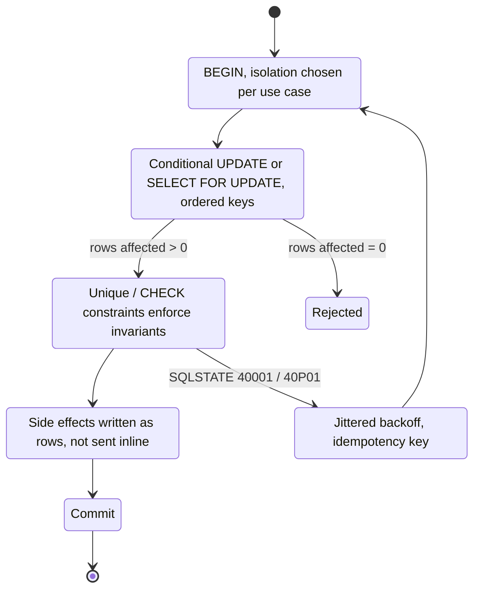

> **Scenario** — একটি wallet service ১০০ balance পড়ে, ৮০ বিয়োগ করে, ২০ লেখে। দুটি concurrent withdrawal দুটোই ১০০ পড়ে, দুটোই ২০ লেখে — ফলে ১০০ টাকার account থেকে ১৬০ বেরিয়ে যায়। Code review-তে সঠিক ছিল, transaction ছিল, আর প্রতিটি single-threaded test পাশ করেছিল।

## কেন গুরুত্বপূর্ণ

- Isolation bug নীরব ও স্থায়ী data corruption বানায় — কোনো error log হয় না, alert বাজে না, সপ্তাহ পরে reconciliation-এ ধরা পড়ে।
- এগুলো probabilistic: reproduce করতে একই কয়েক মিলিসেকেন্ডে দুটি request দরকার, তাই code review, CI ও staging পার হয়ে যায়।
- Default isolation level engine-ভেদে আলাদা (MySQL/InnoDB: `REPEATABLE READ`; PostgreSQL: `READ COMMITTED`), তাই একই code ভিন্ন environment-এ ভিন্ন আচরণ করে।
- "transaction-এ মুড়ে দাও" সবচেয়ে সাধারণ ভুল বোঝাবুঝি: transaction atomicity দেয়, কিন্তু concurrent reader কী দেখবে সেটা ঠিক করে isolation level।
- Financial ও inventory anomaly সরাসরি টাকা হারানো ও manual support কাজে রূপ নেয়।

## লক্ষণ

| Signal | যা দেখবেন |
| --- | --- |
| Ledger reconciliation | Entry-র যোগফল stored balance-এর সাথে মেলে না |
| Inventory | `remaining` negative হয়, বা দুই customer শেষ unit পায় |
| Uniqueness | `SELECT`-then-`INSERT` check যা আটকানো উচিত ছিল, এমন দুটি row |
| Postgres log | `ERROR: could not serialize access due to concurrent update` (SERIALIZABLE / REPEATABLE READ) |
| MySQL log | `Deadlock found when trying to get lock; try restarting transaction` |
| Reproduction | কেবল concurrency > 1 সহ load test-এ |

## কীভাবে ভাঙে

তিনটি আলাদা anomaly, সবগুলোই সাধারণ:

**Lost update.** দুটি transaction একই row পড়ে, application code-এ নতুন মান হিসাব করে, তারপর লেখে। দ্বিতীয় write প্রথমটিকে মুছে দেয়। `READ COMMITTED` এটা অনুমোদন করে; MySQL-এ `REPEATABLE READ`-ও read-modify-write pattern-এ করে, কারণ snapshot read কিছুই lock করে না।

**Write skew.** দুটি transaction একই সেট row পড়ে, প্রতিটি দেখে constraint এখনও ঠিক আছে, তারপর প্রতিটি *ভিন্ন* row লেখে। Row level-এ কোনো সংঘাত নেই, তাই কেউ block হয় না, অথচ মিলিত ফল invariant ভাঙে। ক্লাসিক উদাহরণ: দুই on-call engineer দুজনেই দেখে "অন্তত একজন shift-এ আছে" এবং দুজনেই নিজেকে সরিয়ে নেয়।

**Phantom read.** Uniqueness enforce করতে ব্যবহৃত `SELECT` ("এই email আছে কি?") এখনও-না-থাকা row lock করতে পারে না, তাই দুটি concurrent insert দুটোই check পাস করে।

```mermaid
sequenceDiagram
    participant T1 as "Txn A"
    participant DB as "Database"
    participant T2 as "Txn B"
    T1->>DB: "BEGIN; SELECT balance -> 100"
    T2->>DB: "BEGIN; SELECT balance -> 100"
    T1->>DB: "UPDATE balance = 20"
    T1->>DB: "COMMIT"
    T2->>DB: "UPDATE balance = 20 (overwrites)"
    T2->>DB: "COMMIT"
    Note over DB: "160 withdrawn from a balance of 100"
```

## মূল কারণ

1. Read-modify-write একটি SQL statement-এ না করে application memory-তে করা।
2. Default level-এ কেবল atomicity নিশ্চিত হলেও isolation-এর জন্য `BEGIN`/`COMMIT`-এর উপর ভরসা।
3. Database constraint নয়, `SELECT` check দিয়ে uniqueness enforce করা।
4. একাধিক row জুড়ে constraint (aggregate, "অন্তত একটি", quota) read দিয়ে যাচাই করা, যা কোনো row lock রক্ষা করে না।
5. MySQL ও PostgreSQL-এর `REPEATABLE READ` একই ধরে নেওয়া — Postgres সংঘাত ধরে abort করে, MySQL এই pattern-এ করে না।
6. Serialisation failure-এর পর non-idempotent transaction আবার চালানো retry logic।
7. User-এর ভাবার সময় জুড়ে দীর্ঘ transaction, যা প্রতিটি race window বড় করে।

## কীভাবে সমাধান করবেন

### ১. নতুন মান database-কে হিসাব করতে দিন

সবচেয়ে কার্যকর সমাধান: মানটি কখনও application-এ round-trip করাবেন না।

```sql
-- Atomic ও race-free: statement চলার সময়টুকু row lock ধরা থাকে
UPDATE wallets
SET balance_cents = balance_cents - 8000
WHERE id = 42 AND balance_cents >= 8000;
-- affected row দেখুন: ০ মানে অপর্যাপ্ত টাকা, "success" নয়
```

```php
<?php
$affected = DB::update(
    'UPDATE wallets SET balance_cents = balance_cents - ?
     WHERE id = ? AND balance_cents >= ?',
    [$amount, $walletId, $amount],
);

if ($affected === 0) {
    throw new InsufficientFunds();   // আগের SELECT-কে কখনও বিশ্বাস করবেন না
}
```

### ২. read-then-decide লাগলে স্পষ্টভাবে lock করুন

```sql
BEGIN;
-- Exclusive row lock নেয়; concurrent SELECT ... FOR UPDATE এখানে block হয়
SELECT balance_cents FROM wallets WHERE id = 42 FOR UPDATE;
-- application সিদ্ধান্ত নেয়
UPDATE wallets SET balance_cents = 2000 WHERE id = 42;
INSERT INTO ledger (wallet_id, delta_cents, reason) VALUES (42, -8000, 'withdrawal');
COMMIT;
```

যে engine পার্থক্য গুরুত্বপূর্ণ:

- `FOR UPDATE NOWAIT` queue না করে সাথে সাথে fail করে (দুই engine-এ) — user-facing path-এ ভালো।
- `FOR UPDATE SKIP LOCKED` locked row এড়িয়ে যায়, এভাবেই queue table বানানো হয়।
- Non-indexed predicate-এ MySQL-এর `FOR UPDATE` gap lock দিয়ে অনেক row lock করে ফেলে; PostgreSQL কেবল মিলে যাওয়া tuple lock করে।
- Deadlock এড়াতে সব সময় একই ক্রমে (ascending primary key) row lock করুন।

### ৩. uniqueness constraint-কে দিয়ে করান

```sql
-- SELECT-then-INSERT check পুরোপুরি প্রতিস্থাপন করে
CREATE UNIQUE INDEX CONCURRENTLY idx_users_email_ci ON users (lower(email));

-- Conflict-এ idempotent upsert
INSERT INTO users (id, email, name) VALUES ($1, $2, $3)
ON CONFLICT (lower(email)) DO NOTHING
RETURNING id;
```

Unique-violation error ধরে 409-এ অনুবাদ করুন। Constraint-ই একমাত্র check যাকে race করা যায় না।

### ৪. multi-row invariant-এ SERIALIZABLE — retry সহ

Write skew row lock দিয়ে ঠিক হয় না, কারণ সংঘাতপূর্ণ row আলাদা। Postgres `SERIALIZABLE` (SSI) সংঘাত ধরে একটি transaction SQLSTATE `40001` দিয়ে abort করে।

```ts
async function withSerializableRetry<T>(fn: (tx: Tx) => Promise<T>): Promise<T> {
  for (let attempt = 0; attempt < 5; attempt++) {
    try {
      return await db.transaction({ isolation: 'serializable' }, fn)
    } catch (e) {
      // 40001 serialization_failure, 40P01 deadlock_detected
      if (e.code !== '40001' && e.code !== '40P01') throw e
      await sleep(20 * 2 ** attempt + Math.random() * 20) // jittered backoff
    }
  }
  throw new Error('serialization retries exhausted')
}
```

দুটি শর্ত: transaction body আবার চালানো নিরাপদ হতে হবে (database-এর বাইরে side effect নেই), আর app-এর প্রতিটি `SERIALIZABLE` transaction-এ এই wrapper লাগবে। MySQL-এর `SERIALIZABLE` ভিন্নভাবে কাজ করে — সাধারণ `SELECT`-কে `SELECT ... LOCK IN SHARE MODE` বানায়, যা abort নয় block করে, আর hot path-এর জন্য সাধারণত অতি স্থূল।

### ৫. invariant-কে data বানান যাতে constraint পাহারা দিতে পারে

"অন্তত একজন engineer shift-এ" — এর বদলে counter row রাখুন ও `CHECK` দিন:

```sql
ALTER TABLE shift_summary ADD CONSTRAINT shift_min_staff CHECK (on_call_count >= 1);

-- প্রতিটি add/remove একই transaction-এ summary update করে,
-- তাই application logic নয়, constraint-ই invariant enforce করে।
UPDATE shift_summary SET on_call_count = on_call_count - 1 WHERE shift_id = $1;
```

### ৬. transaction ছোট ও side-effect-মুক্ত রাখুন

Transaction-এর ভেতরে HTTP call নেই, queue publish নেই, email নেই। [outbox pattern](/systems/messaging-async/exactly-once-delivery-illusion) ব্যবহার করুন যাতে effect atomically commit হওয়া row হয়ে পরে dispatch হয়, আর প্রতিটি retryable write-এর সাথে idempotency key রাখুন।

## Target design



## Tradeoff

| Option | সুবিধা | খরচ | কখন বাছবেন |
| --- | --- | --- | --- |
| Conditional `UPDATE` | বাড়তি lock নেই, এক round trip | কেবল single-row গাণিতিক কাজে | Counter, balance, stock |
| `SELECT ... FOR UPDATE` | সরল mental model | Access serialise হয়, deadlock ঝুঁকি | এক row-এ read-then-decide |
| Optimistic locking (`version` column) | Lock ধরে রাখে না, কম contention-এ ভালো | Caller-কে retry/conflict সামলাতে হয় | Editable entity, form |
| `SERIALIZABLE` (Postgres SSI) | Write skew নিজেই ধরে | Contention-এ abort, সর্বত্র retry দরকার | Multi-row invariant |
| Database constraint | Race করা অসম্ভব | Invariant-কে data হিসেবে model করতে হয় | Uniqueness, quota, non-negative |
| Advisory / distributed lock | Table ও service জুড়ে চলে | Lock lifetime ও fencing সমস্যা | Cross-resource critical section |

## যাচাই checklist

- [ ] Concurrency test এক wallet-এ ৫০টি parallel withdrawal চালায় এবং শেষ balance ও ledger sum মেলে কিনা assert করে।
- [ ] প্রতিটি read-modify-write হয় একটি SQL statement, নয় `FOR UPDATE`, নয় version-checked।
- [ ] Uniqueness unique index দিয়ে সমর্থিত, আর app violation error সামলায়।
- [ ] `40001`/`40P01`-এর জন্য jittered backoff ও সীমা সহ retry wrapper আছে।
- [ ] Transaction body-তে কোনো network call নেই; transaction block-এর ভেতর HTTP client grep করা হয়েছে।
- [ ] প্রতিটি code path-এর isolation level স্পষ্ট ও নথিবদ্ধ, default থেকে পাওয়া নয়।
- [ ] Deadlock rate ও `SELECT ... FOR UPDATE` wait time graph করা।
- [ ] একাধিক table ছোঁয়া transaction-এর lock acquisition order নথিবদ্ধ।

## Anti-pattern

- Application code-এ lock বা condition ছাড়া `SELECT` তারপর `UPDATE`।
- পুরো application `SERIALIZABLE` করে retry handling না যোগ করা।
- Card ইতিমধ্যে charge হয়ে যাওয়া transaction retry করা।
- Quota enforce করতে `SELECT count(*)` ব্যবহার।
- ভিন্ন code path-এ ভিন্ন ক্রমে row lock করা।
- Deadlock আলোচনা শেষ করতে `LOCK TABLES`।
- Single-threaded test পাশ করাকে correctness-এর প্রমাণ ধরা।
- User বা API-র অপেক্ষায় transaction খুলে রাখা।

## সম্পর্কিত

- [Concurrent load-এ database deadlock](/systems/data-storage/database-deadlocks-under-load)
- [Replication lag ও read-your-writes](/systems/data-storage/replication-lag-read-your-writes)
- [Connection pool শেষ হয়ে যাওয়া](/systems/data-storage/connection-pool-exhaustion)
- [Hot partition ও hot row সামলানো](/systems/data-storage/hot-partition-mitigation)
