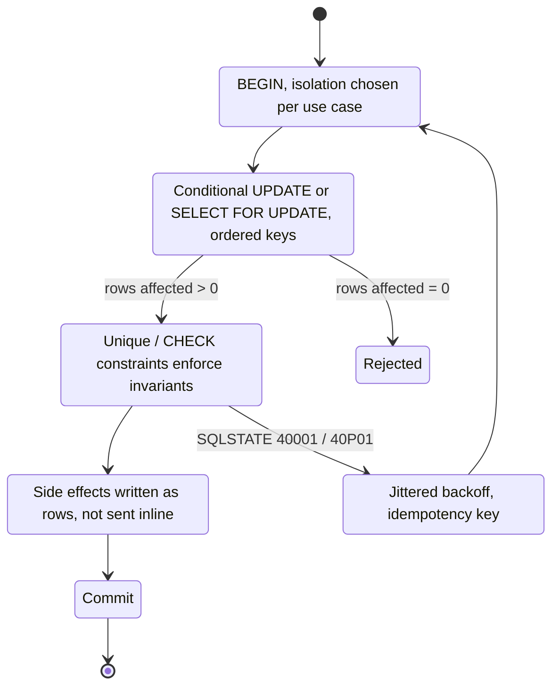

> **Scenario** — A wallet service reads a balance of 100, subtracts 80, and writes 20. Two concurrent withdrawals both read 100 and both write 20, so 160 leaves an account that held 100. The code was correct in review, had a transaction around it, and passed every single-threaded test.

## Why it matters

- Isolation bugs produce silent, permanent data corruption — no error is logged, no alert fires, and reconciliation finds it weeks later.
- They are probabilistic: reproduction needs two requests in the same few milliseconds, so they survive code review, CI, and staging.
- The default isolation level differs by engine (MySQL/InnoDB: `REPEATABLE READ`; PostgreSQL: `READ COMMITTED`), so identical code behaves differently across environments.
- "Wrap it in a transaction" is the most common misunderstanding: transactions give atomicity, but the isolation level decides what concurrent readers may see.
- Financial and inventory anomalies convert directly into money lost and manual support work.

## Symptoms

| Signal | What you observe |
| --- | --- |
| Ledger reconciliation | Sum of entries does not match the stored balance |
| Inventory | `remaining` goes negative, or two customers get the last unit |
| Uniqueness | Two rows that a `SELECT`-then-`INSERT` check should have prevented |
| Postgres logs | `ERROR: could not serialize access due to concurrent update` (SERIALIZABLE / REPEATABLE READ) |
| MySQL logs | `Deadlock found when trying to get lock; try restarting transaction` |
| Reproduction | Only under load tests with concurrency > 1 |

## How it breaks

Three distinct anomalies, all common:

**Lost update.** Two transactions read the same row, compute a new value in application code, and write. The second write overwrites the first. `READ COMMITTED` permits this; so does `REPEATABLE READ` on MySQL for the read-modify-write pattern, because the snapshot read does not lock anything.

**Write skew.** Two transactions read a set of rows, each verifies a constraint that still holds, and each writes a *different* row. Nothing conflicts at the row level, so neither is blocked, yet the combined result violates the invariant. Classic case: two on-call engineers each check "at least one person is on shift" and both remove themselves.

**Phantom read.** A `SELECT` used to enforce uniqueness ("does this email exist?") does not lock rows that do not exist yet, so two concurrent inserts both pass the check.

```mermaid
sequenceDiagram
    participant T1 as "Txn A"
    participant DB as "Database"
    participant T2 as "Txn B"
    T1->>DB: "BEGIN; SELECT balance -> 100"
    T2->>DB: "BEGIN; SELECT balance -> 100"
    T1->>DB: "UPDATE balance = 20"
    T1->>DB: "COMMIT"
    T2->>DB: "UPDATE balance = 20 (overwrites)"
    T2->>DB: "COMMIT"
    Note over DB: "160 withdrawn from a balance of 100"
```

## Root causes

1. Read-modify-write performed in application memory instead of in a single SQL statement.
2. Relying on `BEGIN`/`COMMIT` for isolation when only atomicity is guaranteed at the default level.
3. Uniqueness enforced by a `SELECT` check rather than a database constraint.
4. Constraints spanning multiple rows (aggregates, "at least one", quotas) validated by reading, which no row lock protects.
5. Assuming MySQL `REPEATABLE READ` and PostgreSQL `REPEATABLE READ` behave the same — Postgres detects and aborts conflicts, MySQL does not for this pattern.
6. Retry logic that re-runs a non-idempotent transaction after a serialisation failure.
7. Long transactions spanning user think-time, widening every race window.

## How to solve it

### 1. Make the database compute the new value

The single most effective fix: never round-trip the value through your application.

```sql
-- Atomic and race-free: the row lock is held for the statement's duration
UPDATE wallets
SET balance_cents = balance_cents - 8000
WHERE id = 42 AND balance_cents >= 8000;
-- Check affected rows: 0 means insufficient funds, not "success"
```

```php
<?php
$affected = DB::update(
    'UPDATE wallets SET balance_cents = balance_cents - ?
     WHERE id = ? AND balance_cents >= ?',
    [$amount, $walletId, $amount],
);

if ($affected === 0) {
    throw new InsufficientFunds();   // never trust a prior SELECT
}
```

### 2. Lock explicitly when you must read then decide

```sql
BEGIN;
-- Takes an exclusive row lock; concurrent SELECT ... FOR UPDATE blocks here
SELECT balance_cents FROM wallets WHERE id = 42 FOR UPDATE;
-- application decides
UPDATE wallets SET balance_cents = 2000 WHERE id = 42;
INSERT INTO ledger (wallet_id, delta_cents, reason) VALUES (42, -8000, 'withdrawal');
COMMIT;
```

Engine differences that matter:

- `FOR UPDATE NOWAIT` fails immediately instead of queueing (both engines) — better for user-facing paths.
- `FOR UPDATE SKIP LOCKED` skips locked rows, which is how you build a queue table.
- MySQL `FOR UPDATE` on a non-indexed predicate escalates to locking many rows via gap locks; PostgreSQL locks only matched tuples.
- Always lock rows in a consistent order (ascending primary key) to avoid deadlocks.

### 3. Let constraints enforce uniqueness

```sql
-- Replaces the SELECT-then-INSERT check entirely
CREATE UNIQUE INDEX CONCURRENTLY idx_users_email_ci ON users (lower(email));

-- Idempotent upsert on conflict
INSERT INTO users (id, email, name) VALUES ($1, $2, $3)
ON CONFLICT (lower(email)) DO NOTHING
RETURNING id;
```

Catch the unique-violation error and translate it to a 409. A constraint is the only check that cannot be raced.

### 4. Use SERIALIZABLE for multi-row invariants — with retries

Write skew cannot be fixed by row locks because the conflicting rows differ. Postgres `SERIALIZABLE` (SSI) detects the conflict and aborts one transaction with SQLSTATE `40001`.

```ts
async function withSerializableRetry<T>(fn: (tx: Tx) => Promise<T>): Promise<T> {
  for (let attempt = 0; attempt < 5; attempt++) {
    try {
      return await db.transaction({ isolation: 'serializable' }, fn)
    } catch (e) {
      // 40001 serialization_failure, 40P01 deadlock_detected
      if (e.code !== '40001' && e.code !== '40P01') throw e
      await sleep(20 * 2 ** attempt + Math.random() * 20) // jittered backoff
    }
  }
  throw new Error('serialization retries exhausted')
}
```

Two requirements: the transaction body must be safe to re-run (no side effects outside the database), and every `SERIALIZABLE` transaction in the app needs this wrapper. MySQL's `SERIALIZABLE` works differently — it converts plain `SELECT`s into `SELECT ... LOCK IN SHARE MODE`, which blocks rather than aborts, and is usually too coarse for hot paths.

### 5. Materialise the invariant so a constraint can guard it

Instead of "at least one engineer on shift", keep a counter row and add a `CHECK`:

```sql
ALTER TABLE shift_summary ADD CONSTRAINT shift_min_staff CHECK (on_call_count >= 1);

-- Every add/remove updates the summary in the same transaction,
-- so the constraint — not application logic — enforces the invariant.
UPDATE shift_summary SET on_call_count = on_call_count - 1 WHERE shift_id = $1;
```

### 6. Keep transactions short and side-effect free

No HTTP calls, no queue publishes, no email sends inside a transaction. Use the [outbox pattern](/systems/messaging-async/exactly-once-delivery-illusion) so effects become rows committed atomically and dispatched afterwards, and pair every retryable write with an idempotency key.

## Target design



## Tradeoffs

| Option | Pros | Cons | Choose when |
| --- | --- | --- | --- |
| Conditional `UPDATE` | No extra locks, single round trip | Only works for single-row arithmetic | Counters, balances, stock |
| `SELECT ... FOR UPDATE` | Simple mental model | Serialises access, deadlock risk | Read-then-decide on one row |
| Optimistic locking (`version` column) | No lock held, scales for low contention | Caller must handle retry/conflict | Editable entities, forms |
| `SERIALIZABLE` (Postgres SSI) | Catches write skew automatically | Aborts under contention, needs retries everywhere | Multi-row invariants |
| Database constraint | Impossible to race | Requires modelling the invariant as data | Uniqueness, quotas, non-negative |
| Advisory / distributed lock | Works across tables and services | Lock lifetime and fencing problems | Cross-resource critical sections |

## Verification checklist

- [ ] A concurrency test fires 50 parallel withdrawals against one wallet and asserts the final balance and ledger sum agree.
- [ ] Every read-modify-write is either one SQL statement, `FOR UPDATE`, or version-checked.
- [ ] Uniqueness is backed by a unique index, and the app handles the violation error.
- [ ] Retry wrapper exists for `40001`/`40P01` with jittered backoff and a cap.
- [ ] Transaction bodies contain no network calls; grep for HTTP clients inside transaction blocks.
- [ ] Isolation level per code path is explicit and documented, not inherited from a default.
- [ ] Deadlock rate and `SELECT ... FOR UPDATE` wait time are graphed.
- [ ] Lock acquisition order documented for any transaction touching more than one table.

## Anti-patterns

- `SELECT` then `UPDATE` in application code with no lock or condition.
- Setting the whole application to `SERIALIZABLE` and not adding retry handling.
- Retrying a transaction that already charged a card.
- Using `SELECT count(*)` to enforce a quota.
- Locking rows in different orders in different code paths.
- `LOCK TABLES` to end a deadlock discussion.
- Treating a passing single-threaded test as evidence of correctness.
- Long transactions that stay open while waiting for a user or an API.

## Related

- [Database deadlocks under concurrent load](/systems/data-storage/database-deadlocks-under-load)
- [Replication lag and read-your-writes](/systems/data-storage/replication-lag-read-your-writes)
- [Connection pool exhaustion](/systems/data-storage/connection-pool-exhaustion)
- [Hot partition and hot row mitigation](/systems/data-storage/hot-partition-mitigation)
