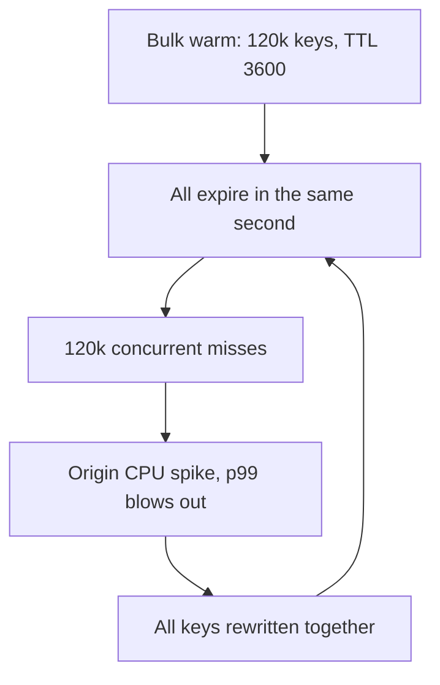
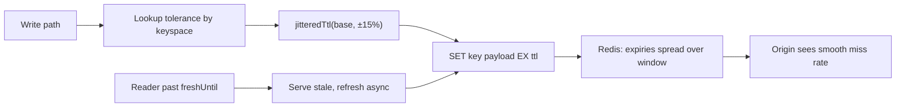

> **Scenario** - রাত 03:00-এর deploy `SETEX product:{id} 3600` দিয়ে 120,000 product key warm করে। এরপর প্রতি ঘণ্টায় ঠিক :00-এ database-এ 90 সেকেন্ডের CPU spike দেখা যায়, কারণ 120,000 key একই সেকেন্ডে expire করে। তিন সপ্তাহ কেউ এই ঘণ্টাভিত্তিক spike-কে deploy-এর সাথে মেলাতে পারে না।

## Why it matters

- Uniform TTL পুরো cache fleet-কে synchronize করে দেয়। একটি bulk write এমন পুনরাবৃত্ত load spike তৈরি করে যা কারণ-deploy-এর চেয়েও বেশি দিন বাঁচে।
- আপনার data সর্বোচ্চ কতটা ভুল হতে পারে, TTL-ই তার একমাত্র সীমা। অভ্যাসবশত ("3600 ঠিকই আছে") বেছে নিলে staleness budget দুর্ঘটনাক্রমে ঠিক হয়।
- খুব ছোট হলে origin cost সারাক্ষণ; খুব বড় হলে একটি missed invalidation বহু ঘণ্টার correctness incident।
- Expiry spike average-এ অদৃশ্য। ঘণ্টায় একবার 90 সেকেন্ডের CPU spike দৈনিক graph নাড়ায় না, কিন্তু ভেতরের user-দের p99 ধ্বংস করে।
- Capacity planning miss rate-এর উপর নির্ভর করে। miss যদি uniform না হয়ে burst-এ আসে, আপনার headroom হিসাব burst factor-এর সমান ভুল।

## Symptoms

| Signal | What you observe |
|--------|------------------|
| Origin QPS | round clock boundary-তে (`:00`, `:30`) চূড়াসহ sawtooth |
| `TTL` sampling | `redis-cli --scan` + `TTL` হাজারো key-তে একই remaining value দেখায় |
| Redis `expired_keys` | smooth rate নয়, step function |
| p99 latency | traffic নয়, TTL period-এর সাথে মিলিয়ে periodic spike |
| Post-deploy pattern | bulk warm বা import-এর ঠিক এক TTL পরে spike শুরু |
| Miss rate | window-এর বেশিরভাগ সময় প্রায় শূন্য, তারপর কয়েক সেকেন্ড 100% |

## How it breaks

TTL correlation তৈরি হয় এমন যেকোনো operation থেকে যা একসাথে অনেক key লেখে: warm script, cache rebuild, bulk import, বা cold থেকে repopulate করা fleet restart। প্রতিটি key একই expiry deadline পায়। Redis lazily ও background cycle-এ expire করে, তাই সবগুলো খুব ছোট window-এ miss হয়ে যায়।

Pattern নিজেকে টিকিয়ে রাখে। stampede আবার একসাথে সব key repopulate করে, ফলে পরের cycle-এর জন্য TTL আবার synchronize হয়। হস্তক্ষেপ ছাড়া phase কখনো drift করে না।



## Root causes

1. প্রতিটি write path একই constant TTL literal ব্যবহার করে।
2. Bulk operation (warm, import, migration) ছোট window-এ বড় keyspace স্পর্শ করে।
3. TTL নথিভুক্ত staleness tolerance থেকে নয়, round number থেকে বাছা।
4. *logical* freshness deadline ও *physical* key lifetime-এর মধ্যে কোনো পার্থক্য নেই।
5. Redis restart-এর পর cold-start repopulation সবকিছু আবার একসাথে synchronize করে।
6. Cron job নির্দিষ্ট schedule-এ refresh করে, key-প্রতি কোনো offset নেই।

## How to solve it

### 1. Derive the TTL from a stated tolerance

সংখ্যা লেখার আগে keyspace-প্রতি tolerance লিখে ফেলুন। "product price সর্বোচ্চ 5 মিনিট stale হতে পারে" মানে 300 s। "feature flag 10 সেকেন্ডের মধ্যে কার্যকর হতে হবে" মানে 10 s + push invalidation।

```ts
export const TTL_SECONDS = {
  'product:detail': 300,    // tolerance: 5 min stale pricing
  'user:profile': 900,      // tolerance: 15 min stale display name
  'flags:global': 10,       // tolerance: 10 s, plus pub/sub invalidation
  'geo:country': 86_400,    // tolerance: 1 day, effectively static
} as const
```

### 2. Add proportional jitter to every write

মিশ্র TTL-এ fixed jitter band যথেষ্ট নয়। শতাংশ ব্যবহার করুন যাতে spread base-এর সাথে scale করে।

```ts
const JITTER_RATIO = 0.15 // ±15%

export function jitteredTtl(baseSeconds: number): number {
  const spread = baseSeconds * JITTER_RATIO
  return Math.max(1, Math.round(baseSeconds - spread + Math.random() * 2 * spread))
}

await redis.set(key, payload, 'EX', jitteredTtl(TTL_SECONDS['product:detail']))
```

Laravel-এ একই জিনিস, এক জায়গায় - যাতে কোনো call site ভুলতে না পারে:

```php
final class JitteredCache
{
    public function put(string $key, mixed $value, int $baseTtl): void
    {
        $spread = (int) round($baseTtl * 0.15);
        Cache::put($key, $value, random_int($baseTtl - $spread, $baseTtl + $spread));
    }
}
```

3,600 s base-এ ±15% দিলে expiry 1,080 সেকেন্ডের window-এ ছড়ায়। 120,000-key spike হয়ে যায় সেকেন্ডে ~111 miss - সাধারণ traffic।

### 3. Separate logical freshness from physical TTL

physical TTL logical-এর কয়েক গুণ বড় রাখুন, যাতে refresh চলাকালে key কখনো সত্যিই অনুপস্থিত না থাকে। `freshUntil` পেরোনো reader stale serve করে ও background refresh trigger করে।

```ts
const entry = { value, freshUntil: Date.now() + 300_000 }
await redis.set(key, JSON.stringify(entry), 'EX', jitteredTtl(3_600))
```

### 4. Push the same idea to the edge

`Cache-Control`-এ jitter primitive নেই, তাই origin থেকে response-প্রতি `max-age` বদলান।

```
Cache-Control: public, max-age=278, stale-while-revalidate=600
Surrogate-Control: max-age=290, stale-while-revalidate=600, stale-if-error=86400
```

```nginx
map $request_id $edge_ttl {
    # Cheap per-response spread without application changes.
    default 300;
}

location /api/products/ {
    proxy_cache app_cache;
    proxy_cache_valid 200 5m;
    proxy_cache_lock on;
    proxy_cache_background_update on;
    proxy_cache_use_stale updating error timeout;
    proxy_ignore_headers Set-Cookie;
}
```

application থেকে jittered `max-age` পাঠানোই ভালো - object-প্রতি tolerance কেবল সেই জায়গাই জানে।

### 5. Jitter the refresh schedule too

key refresh করা যেকোনো cron-এ প্রতিটি key deterministic offset পাক (যেমন key hash করে window-এ ফেলা), যাতে একই key সবসময় একই সেকেন্ডে refresh না হয়।

## Target design



## Tradeoffs

| Option | Pros | Cons | Choose when |
|--------|------|------|-------------|
| Fixed TTL, no jitter | সহজে অনুমেয়; staleness ভাবা সোজা | যেকোনো bulk write-এর পর synchronized expiry storm | ছোট keyspace, একসাথে miss হলেও ক্ষতি নেই |
| Proportional jitter | মসৃণ miss rate; এক লাইনের পরিবর্তন | staleness bound সংখ্যা নয়, range হয়ে যায় | প্রায় সবসময় - এটাই default |
| Long physical TTL + logical freshness | key কখনো অনুপস্থিত নয়; stale serving সম্ভব | দুটি timestamp সামলাতে হয়; বেশি memory | recomputation ব্যয়বহুল ও staleness সহনীয় |
| Very short TTL | invalidation plumbing ছাড়াই freshness | ক্রমাগত origin load; cache প্রায় অকেজো | সস্তা origin query বা দ্রুত বদলানো data |
| No TTL, event-driven only | নিখুঁত hit ratio, expiry spike নেই | একটি missed event মানে স্থায়ীভাবে ভুল data | প্রতিটি writer আপনার ও change stream নির্ভরযোগ্য |

## Verification checklist

- [ ] `redis-cli --scan --pattern 'product:*' | head -1000 | xargs -n1 redis-cli TTL` দিয়ে 1,000 key নমুনা নিন; মান spread হওয়া উচিত, spike নয়।
- [ ] `INFO stats`-এর `expired_keys` rate হিসেবে plot করুন; সিঁড়ি নয়, সমতল হওয়া উচিত।
- [ ] 24 ঘণ্টার window-এ origin QPS-এ clock boundary-তে periodic peak নেই।
- [ ] প্রতিটি keyspace-এর TTL constant-এর পাশে নথিভুক্ত staleness tolerance আছে।
- [ ] Redis restart ও পূর্ণ repopulation-এর পর এক cycle-এর মধ্যে TTL spread ফিরে আসে।
- [ ] `curl -sI https://example.com/api/products/42 | grep -i cache-control` পরপর দুটি object-এ ভিন্ন `max-age` দেখায়।

## Anti-patterns

- একটি `CACHE_TTL=3600` environment variable পুরো codebase-এর প্রতিটি keyspace ব্যবহার করছে।
- jitter শুধু application layer-এ, অথচ warm script এখনো raw base TTL ব্যবহার করছে।
- 24 ঘণ্টার TTL-এ ±30 সেকেন্ডের additive jitter - এই স্কেলে spread অর্থহীন।
- stampede-এর পর TTL বাড়ানো, যা পরেরটিকে পিছিয়ে দেয় ও বড় করে।
- একটি cron-এ `0 * * * *`-এ সব key refresh করা।
- `stale-while-revalidate`-কে jitter-এর বিকল্প ভাবা; latency-তে সাহায্য করে, কিন্তু origin এখনো synchronized revalidation wave দেখে।

## Related

- [Cache stampede prevention with locks and early refresh](/systems/caching-cdn/cache-stampede-prevention)
- [stale-while-revalidate and stale-if-error patterns](/systems/caching-cdn/stale-while-revalidate-patterns)
- [Choosing a cache eviction policy that matches your workload](/systems/caching-cdn/cache-eviction-policy-choice)
- [Cache invalidation strategies that survive deploys](/systems/caching-cdn/cache-invalidation-strategies)
