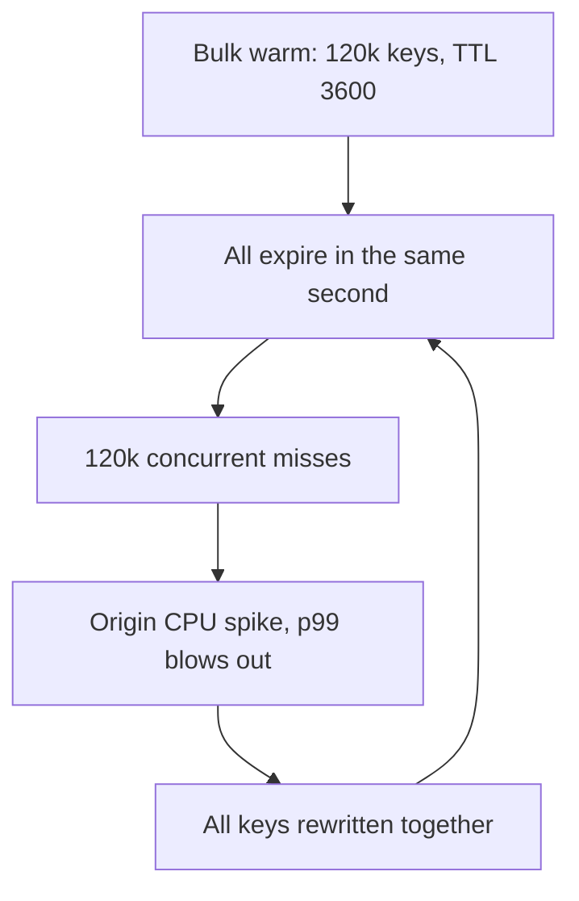
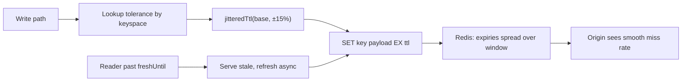

> **Scenario** - A deploy at 03:00 warms 120,000 product keys with `SETEX product:{id} 3600`. Every hour after that, at :00 exactly, the database sees a 90-second CPU spike as all 120,000 keys expire in the same second. Nobody connects the hourly spike to the deploy for three weeks.

## Why it matters

- Uniform TTLs synchronize your entire cache fleet. One bulk write creates a recurring, self-perpetuating load spike that outlives the deploy that caused it.
- TTL is the only bound on how wrong your data can be. Choosing it by habit ("3600 looks fine") means your staleness budget is accidental.
- Too short and you pay origin cost continuously; too long and a single missed invalidation becomes a multi-hour correctness incident.
- Expiry spikes are invisible in averages. A 90-second CPU spike once an hour barely moves a daily graph but destroys p99 for the users inside it.
- Capacity planning depends on miss rate. If misses arrive in bursts rather than uniformly, your headroom calculation is wrong by the burst factor.

## Symptoms

| Signal | What you observe |
|--------|------------------|
| Origin QPS | Sawtooth with peaks at round clock boundaries (`:00`, `:00` and `:30`) |
| `TTL` sampling | `redis-cli --scan` plus `TTL` shows the same remaining value across thousands of keys |
| Redis `expired_keys` | Step function rather than a smooth rate |
| p99 latency | Periodic spikes correlated with the TTL period, not with traffic |
| Post-deploy pattern | Spikes begin exactly one TTL after a bulk warm or import |
| Miss rate | Near zero for most of the window, then 100% for a few seconds |

## How it breaks

TTL correlation is created by any operation that writes many keys at once: a warm script, a cache rebuild, a bulk import, or a fleet restart that repopulates from cold. Each of those keys gets an identical expiry deadline. Redis expires lazily plus in a background cycle, so all of them become misses inside a very small window.

The pattern is self-reinforcing. The stampede repopulates all the keys at the same time again, which re-synchronizes their TTLs for the next cycle. Without intervention the phase never drifts.



## Root causes

1. A constant TTL literal shared by every write path.
2. Bulk operations (warm, import, migration) that touch a large keyspace in a short window.
3. TTL chosen from a round number rather than from a documented staleness tolerance.
4. No distinction between a *logical* freshness deadline and the *physical* key lifetime.
5. Cold-start repopulation after a Redis restart, which re-synchronizes everything at once.
6. Cron jobs that refresh on a fixed schedule with no per-key offset.

## How to solve it

### 1. Derive the TTL from a stated tolerance

Write the tolerance down per keyspace before writing the number. "Product prices may be up to 5 minutes stale" gives you 300 s. "Feature flag state must apply within 10 seconds" gives you 10 s plus a push invalidation.

```ts
export const TTL_SECONDS = {
  'product:detail': 300,    // tolerance: 5 min stale pricing
  'user:profile': 900,      // tolerance: 15 min stale display name
  'flags:global': 10,       // tolerance: 10 s, plus pub/sub invalidation
  'geo:country': 86_400,    // tolerance: 1 day, effectively static
} as const
```

### 2. Add proportional jitter to every write

A fixed jitter band is not enough for mixed TTLs. Use a percentage so the spread scales with the base.

```ts
const JITTER_RATIO = 0.15 // ±15%

export function jitteredTtl(baseSeconds: number): number {
  const spread = baseSeconds * JITTER_RATIO
  return Math.max(1, Math.round(baseSeconds - spread + Math.random() * 2 * spread))
}

await redis.set(key, payload, 'EX', jitteredTtl(TTL_SECONDS['product:detail']))
```

Laravel equivalent, applied in one place so no call site can forget it:

```php
final class JitteredCache
{
    public function put(string $key, mixed $value, int $baseTtl): void
    {
        $spread = (int) round($baseTtl * 0.15);
        Cache::put($key, $value, random_int($baseTtl - $spread, $baseTtl + $spread));
    }
}
```

With ±15% on a 3,600 s base, expiries spread across an 1,080-second window. The 120,000-key spike becomes roughly 111 misses per second - ordinary traffic.

### 3. Separate logical freshness from physical TTL

Keep the physical TTL several times longer than the logical one so a key is never truly absent during a refresh. Readers past `freshUntil` serve stale and trigger a background refresh.

```ts
const entry = { value, freshUntil: Date.now() + 300_000 }
await redis.set(key, JSON.stringify(entry), 'EX', jitteredTtl(3_600))
```

### 4. Push the same idea to the edge

`Cache-Control` has no jitter primitive, so vary `max-age` per response at the origin.

```
Cache-Control: public, max-age=278, stale-while-revalidate=600
Surrogate-Control: max-age=290, stale-while-revalidate=600, stale-if-error=86400
```

```nginx
map $request_id $edge_ttl {
    # Cheap per-response spread without application changes.
    default 300;
}

location /api/products/ {
    proxy_cache app_cache;
    proxy_cache_valid 200 5m;
    proxy_cache_lock on;
    proxy_cache_background_update on;
    proxy_cache_use_stale updating error timeout;
    proxy_ignore_headers Set-Cookie;
}
```

Prefer emitting a jittered `max-age` from the application - it is the only place that knows the per-object tolerance.

### 5. Jitter the refresh schedule too

Any cron that refreshes keys should offset each key deterministically, for example by hashing the key into the window, so the same key does not always refresh at the same second.

## Target design



## Tradeoffs

| Option | Pros | Cons | Choose when |
|--------|------|------|-------------|
| Fixed TTL, no jitter | Trivially predictable; easy to reason about staleness | Synchronized expiry storms after any bulk write | Tiny keyspaces where a simultaneous miss is harmless |
| Proportional jitter | Smooth miss rate; one-line change | Staleness bound becomes a range, not a number | Almost always - this is the default |
| Long physical TTL + logical freshness | No key is ever absent; stale serving possible | Two timestamps to reason about; more memory held | Recomputation is expensive and staleness is tolerable |
| Very short TTL | Freshness without invalidation plumbing | Continuous origin load; cache barely helps | Cheap origin queries or rapidly changing data |
| No TTL, event-driven only | Perfect hit ratio, no expiry spikes | A missed event means permanently wrong data | You own every writer and have a reliable change stream |

## Verification checklist

- [ ] Sample 1,000 keys with `redis-cli --scan --pattern 'product:*' | head -1000 | xargs -n1 redis-cli TTL` and confirm the values form a spread, not a spike.
- [ ] Plot `expired_keys` from `INFO stats` as a rate; it should be flat, not a staircase.
- [ ] Origin QPS has no periodic peaks aligned to clock boundaries over a 24-hour window.
- [ ] Every keyspace has a documented staleness tolerance next to its TTL constant.
- [ ] After a Redis restart and full repopulation, TTL spread re-establishes within one cycle.
- [ ] `curl -sI https://example.com/api/products/42 | grep -i cache-control` shows a `max-age` that differs between two consecutive objects.

## Anti-patterns

- A single `CACHE_TTL=3600` environment variable used by every keyspace in the codebase.
- Jitter added only at the application layer while a warm script still uses the raw base TTL.
- Additive jitter of ±30 seconds on a 24-hour TTL - the spread is meaningless at that scale.
- Raising the TTL after a stampede, which delays and enlarges the next one.
- Refreshing all keys from a single cron at `0 * * * *`.
- Treating `stale-while-revalidate` as a substitute for jitter; it helps latency but the origin still sees the synchronized revalidation wave.

## Related

- [Cache stampede prevention with locks and early refresh](/systems/caching-cdn/cache-stampede-prevention)
- [stale-while-revalidate and stale-if-error patterns](/systems/caching-cdn/stale-while-revalidate-patterns)
- [Choosing a cache eviction policy that matches your workload](/systems/caching-cdn/cache-eviction-policy-choice)
- [Cache invalidation strategies that survive deploys](/systems/caching-cdn/cache-invalidation-strategies)
