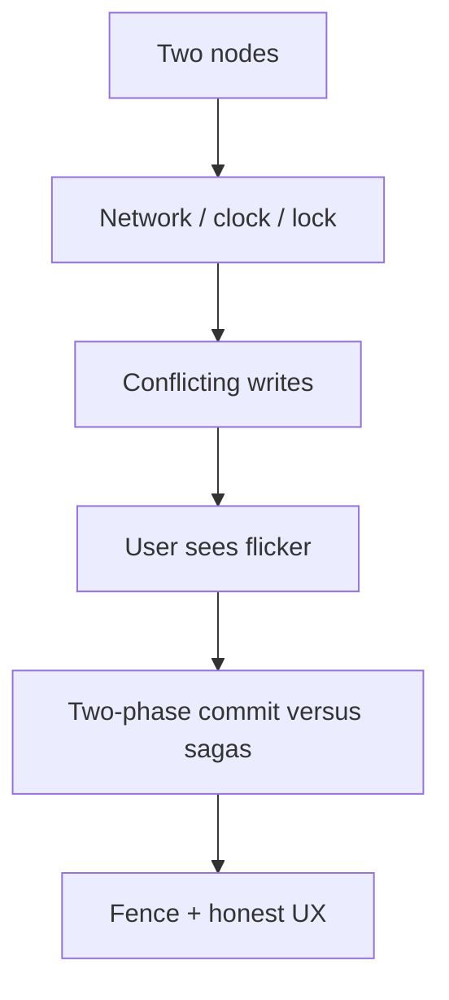

> **Lesson 164 · advanced** - 2PC gives you atomicity and a coordinator that can freeze every participant; sagas give you availability and the obligation to write compensations. Most teams need sagas plus an outbox.

## Why it matters

- Two Laravel boxes and a Redis lock still need a story for clocks, split brain, and “exactly once”.
- PACELC is the lunch-menu version of CAP: when the network is fine you still pay latency for consistency.
- Gossip, membership, and multi-region failover are how “the other DC is down” becomes a user-visible banner.
- This lesson is specifically about **Two-phase commit versus sagas**. Tags: 2pc, saga, transactions, compensation, outbox.

## Symptoms

| Signal | What you observe |
| --- | --- |
| Split | Two leaders both accept writes |
| Clock | Last-write-wins deletes the newer ticket because NTP drifted |
| Failover | DNS still points at the sick region for 30 minutes |
| Illusion | Team believes Kafka is exactly-once end to end |

## How it breaks



The named technology is rarely the villain. Two code paths (often a Vue/Quasar screen and a Laravel write) assume opposite contracts. Production finds the race. For this topic that contract is: 2PC gives you atomicity and a coordinator that can freeze every participant; sagas give you availability and the obligation to write compensations. Most teams need sagas plus an outbox.

## Root causes

1. No fencing token on the lock; a paused process kept writing.
2. Timestamps compared across hosts without a true time source.
3. Health check was HTTP 200 on nginx, not on the Laravel dependency.
4. Delivery guarantee of the broker confused with business idempotency.

## How to solve it

### 1. Write the invariant in one sentence

2PC gives you atomicity and a coordinator that can freeze every participant; sagas give you availability and the obligation to write compensations. Most teams need sagas plus an outbox. Put that sentence in the PR, the Pinia action, and the Laravel class.

### 2. Guard the edge in code

```ts
// Show eventual consistency honestly in the UI
if (ticket.status === 'pending_sync') return 'Saving across regions…'
```

```php
Cache::lock('ticket:'.$id, 10)->get(function () use ($id) {
    // fencing: lock owner id stored; expired owner must not commit
    return Ticket::query()->findOrFail($id);
});
```

### 3. Keep a chart you will actually look at

Cross-region lag, lock wait, and split-brain detections. If the chart cannot catch a regression in **Two-phase commit versus sagas**, the lesson is not done.

## Worked example

A Redis lock expired while a report job paused on GC. The job resumed and overwrote a newer edit. A fencing token (lock generation in the row) made the late writer abort.

On this topic, start from the symptom in the table that matches your last incident, then walk the diagram until the guard above would have fired.

## Check before you ship

- [ ] The invariant for **Two-phase commit versus sagas** is written in one sentence.
- [ ] Empty, duplicate, timeout, or permission paths have a test or a staged rehearsal.
- [ ] A dashboard or log query would catch a regression within one deploy.
- [ ] Related reading still makes sense: distributed-locks-correctness, eventual-consistency-user-experience, quorum-read-write-tuning.

## What not to do

- Copy a blog snippet that retries forever or caches the error as success.
- Treat Pinia as the source of truth for a Laravel row.
- Skip the previous numbered lesson if this one feels dense — the path is beginner → intermediate → advanced on purpose.
