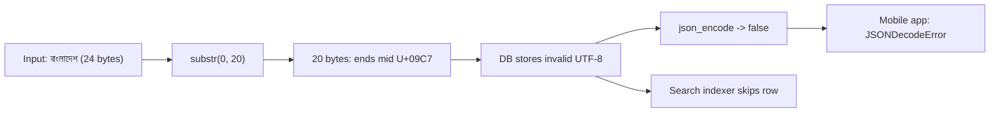
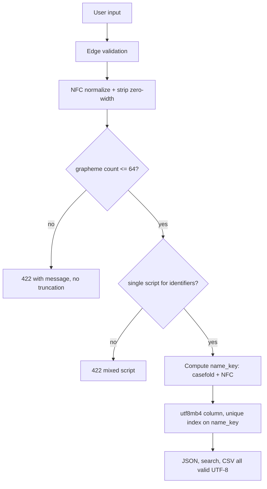

> **Scenario** — একটা signup form `substr($name, 0, 20)` দিয়ে display name ২০ character-এ কাটে। এক user `বাংলাদেশ প্রকৌশল বিশ্ববিদ্যালয়` নামে register করে। জমা হওয়া মান sequence-এর মাঝে শেষ হয়, JSON API invalid UTF-8 দেয়, আর যে screen-এ ওই user দেখানো হয় সেখানে mobile app `JSONDecodeError`-এ crash করে।

## Why it matters

- `substr` byte গোনে, `strlen` byte গোনে, আর user গোনে যা দেখে। `বাংলাদেশ` = ২৪ byte, ৮ code point, ৪ grapheme cluster — তিনটা আলাদা "length", তিনটাই যুক্তিসঙ্গত, কোনোটাই বিনিময়যোগ্য নয়।
- Invalid UTF-8 ছড়ায়। একটা truncated row তাকে ছোঁয়া প্রতিটি downstream JSON encoder, search indexer ও CSV export ভাঙে।
- MySQL-এর `utf8` charset আসলে `utf8mb3`, ৪ byte-এর character রাখতে পারে না। Support ticket-এ একটা emoji `Incorrect string value: '\xF0\x9F\x98\x80'` আর failed insert দেয়।
- দুইটা username দেখতে হুবহু এক কিন্তু byte আলাদা হতে পারে (Latin `a` বনাম Cyrillic `а`, U+0430)। এটা account-takeover vector, সৌন্দর্যের প্রশ্ন নয়।
- Collation uniqueness ঠিক করে। `utf8mb4_0900_ai_ci`-তে `rene` আর `René` unique index-এ সংঘর্ষ করে; `utf8mb4_bin`-এ করে না।

## Symptoms

| Signal | What you observe |
|---|---|
| Broken glyphs | `বাংলাদ\xE0\xA6` → `বাংলাদ` + replacement character U+FFFD |
| JSON errors | নির্দিষ্ট কিছু row-তেই `json_encode` `JSON_ERROR_UTF8`-সহ `false` দেয় |
| Insert failures | `Incorrect string value: '\xF0\x9F\x98\x80' for column 'body'` |
| Length surprises | JS-এ `'👨‍👩‍👧‍👦'.length === 11`, অথচ user একটা character লিখেছে |
| Duplicate accounts | একই render হওয়া নামে দুই user; `SELECT ... WHERE name = ?` কোনোটাই মেলায় না |
| Search misses | `café` খুঁজলে কিছু পাওয়া যায় না, কারণ row NFD-তে জমা (`cafe` + U+0301) |
| Sort order | বাংলা নাম dictionary order নয়, byte value অনুযায়ী sort |
| Silent data loss | নাম জমা হয়, কিন্তু শেষ যুক্তাক্ষর হারিয়ে গেছে |

## How it breaks

তিনটা আলাদা ধারণা মিলে যায়: byte, code point, grapheme cluster। `বাংলাদেশ` = ব U+09AC, া U+09BE, ং U+0982, ল U+09B2, া U+09BE, দ U+09A6, ে U+09C7, শ U+09B6 — ৮ code point, UTF-8-এ প্রতিটি ৩ byte, মোট ২৪ byte। পাঠকের কাছে এটা ৪ একক: বাং, লা, দে, শ। ২০ byte-এ কাটলে ৭ম code point (U+09C7)-এর ভেতরে কাটা পড়ে, একটা একলা continuation byte থাকে। Truncation-এর জায়গায় কিছুই throw করে না; error পরে, অন্য service-এ, decode failure হিসেবে দেখা দেয়।



## Root causes

1. User text-এ byte-ভিত্তিক string function (`substr`, `strlen`, `str_pad`) ব্যবহার।
2. Column length limit byte-এ, অথচ validation character গোনে।
3. Column, table *এবং* connection-এ `utf8mb4`-এর বদলে MySQL `utf8` / `utf8mb3`।
4. Input-এ normalization নেই, তাই একই নামের NFC ও NFD রূপ আলাদা row।
5. Username ও slug-জাতীয় identifier-এ confusable/homoglyph check নেই।
6. কেউ সিদ্ধান্ত না নিয়েই uniqueness case- ও accent-insensitive collation-এর উপর নির্ভর করা।
7. Edge-এ validate করে reject না করে storage layer-এ truncate করা।

## How to solve it

### 1. Grapheme cluster-এ গুনুন, cluster boundary-তে কাটুন

```ts
function truncateGraphemes(input: string, max: number): string {
  const seg = new Intl.Segmenter('bn', { granularity: 'grapheme' })
  const out: string[] = []
  for (const { segment } of seg.segment(input)) {
    if (out.length >= max) break
    out.push(segment)
  }
  return out.join('')
}

const name = 'বাংলাদেশ'
console.log(new TextEncoder().encode(name).length)  // 24 byte
console.log([...name].length)                        // 8 code point
console.log(truncateGraphemes(name, 3))              // 'বাংলা' — ৩ cluster, বৈধ

const family = '👨‍👩‍👧‍👦'
console.log(family.length)                           // 11 UTF-16 unit
console.log([...family].length)                      // 7 code point
console.log(truncateGraphemes(family, 1))            // পুরো পরিবার, অর্ধেক নয়
```

ZWJ sequence code-point ৪-এ কাটলে `👨‍👩` আসে — ভিন্ন একটা পরিবার। Display text-এর জন্য grapheme boundary-ই একমাত্র নিরাপদ কাটার জায়গা।

### 2. পুরো path utf8mb4 করুন

```sql
ALTER DATABASE app CHARACTER SET utf8mb4 COLLATE utf8mb4_0900_ai_ci;

ALTER TABLE users
  MODIFY display_name VARCHAR(64)
  CHARACTER SET utf8mb4 COLLATE utf8mb4_0900_ai_ci NOT NULL;

-- যাচাই: ৩-byte charset-এ থাকা যেকোনো column একটা মাইন
SELECT table_name, column_name, character_set_name, collation_name
FROM information_schema.columns
WHERE table_schema = 'app'
  AND character_set_name IS NOT NULL
  AND character_set_name <> 'utf8mb4';
```

Connection charset column-এর মতোই গুরুত্বপূর্ণ। PHP-তে:

```php
$pdo = new PDO('mysql:host=db;dbname=app;charset=utf8mb4', $user, $pass, [
    PDO::ATTR_ERRMODE => PDO::ERRMODE_EXCEPTION,
]);
```

খেয়াল রাখুন MySQL-এ `VARCHAR(64)` character গোনে, কিন্তু index prefix limit byte গোনে: ৬৪ character × ৪ byte = ২৫৬ byte, যা InnoDB-র ৩০৭২ byte সীমায় ঢোকে; `VARCHAR(1000)`-এর unique index ঢোকে না।

### 3. Input-এ একবার, edge-এ normalize করুন

```php
function normalizeName(string $raw): string
{
    if (!Normalizer::isNormalized($raw, Normalizer::FORM_C)) {
        $raw = Normalizer::normalize($raw, Normalizer::FORM_C);
    }
    // অদৃশ্য কিন্তু byte বদলে দেয় এমন zero-width character বাদ
    $raw = preg_replace('/[\x{200B}\x{200C}\x{200D}\x{FEFF}]/u', '', $raw);
    return trim($raw);
}

// 'café' NFC  = ৫ code point, ৬ byte (U+00E9)
// 'café' NFD  = ৬ code point, ৭ byte (U+0065 U+0301)
// NFC normalization-এর পর দুইটাই সমান।
```

ZWJ নিয়ে সাবধান: U+200D বাদ দিলে বৈধ emoji ও কিছু Indic যুক্তাক্ষর ভাঙে। *Identifier* field-এ (username, slug) বাদ দিন, *display* ও *content* field-এ রাখুন।

### 4. Identifier-কে confusable থেকে রক্ষা করুন

```python
import unicodedata

LATIN_A, CYRILLIC_A = "a", "\u0430"

def scripts(s: str) -> set[str]:
    out = set()
    for ch in s:
        if ch.isalpha():
            name = unicodedata.name(ch, "")
            out.add(name.split()[0])  # 'LATIN', 'CYRILLIC', 'BENGALI'
    return out

def reject_mixed_script(username: str) -> None:
    found = scripts(username)
    if len(found) > 1:
        raise ValueError(f"mixed scripts in identifier: {sorted(found)}")

print(f"admin" == f"admin".replace(LATIN_A, CYRILLIC_A))  # False, দেখতে এক
reject_mixed_script("аdmin")  # raises: {'CYRILLIC', 'LATIN'}
```

Single-script identifier ঠিক আছে; mixed-script প্রায় কখনোই নয়।

### 5. Uniqueness স্পষ্টভাবে ঠিক করুন

Normalized, case-folded রূপ ধরে রাখা একটা generated `name_key` column যোগ করুন, unique index সেখানে দিন। তখন uniqueness নিয়ম পড়া ও test করা যায় এমন কোড, কোনো collation default-এর পার্শ্বপ্রতিক্রিয়া নয়।

### 6. Edge-এ validate করুন, truncate নয় reject

নাম ৬৪ grapheme cluster ছাড়ালে স্পষ্ট message-সহ 422 দিন। নীরব truncation ডেটা নষ্ট করে আর যে ঠিক করতে পারত তার কাছেই বাগ লুকায়।

## Target design



## Tradeoffs

| Option | Pros | Cons | Choose when |
|---|---|---|---|
| Byte-length limit | Storage-এর সাথে হুবহু মেলে | Multi-byte text কাটে; user-বিরোধী | শুধু binary blob |
| Code-point limit | সহজ, library লাগে না | Emoji ও যুক্তাক্ষর ভাঙে | Internal identifier |
| Grapheme-cluster limit | User যা দেখে তার সাথে মেলে | `Intl.Segmenter` বা ICU লাগে | যেকোনো user-visible text field |
| NFC normalization | তুলনা ও search সঙ্গতিপূর্ণ | User-এর পাঠানো হুবহু byte হারায় | নাম, search key, identifier |
| NFD storage | Decomposed input রক্ষা | লম্বা, naive `LIKE` ভাঙে | পুরনো macOS ডেটার সাথে interop |
| Accent-insensitive collation | ক্ষমাশীল search | অনাকাঙ্ক্ষিত uniqueness সংঘর্ষ | Search column, unique key নয় |
| Binary collation | নিখুঁত, predictable | Case-sensitive; ভাষাগত sort নেই | Token, hash, slug |

## Verification checklist

- [ ] Test fixture-এ `বাংলাদেশ`, `ক্ষ` (U+0995 U+09CD U+09B7), `👨‍👩‍👧‍👦`, NFC ও NFD দুই রূপে `café`, এবং একটা right-to-left নাম আছে।
- [ ] `SELECT ... FROM information_schema.columns WHERE character_set_name <> 'utf8mb4'` user-data-তে শূন্য row দেয়।
- [ ] Round-trip test: প্রতিটি fixture insert করে পড়ে byte equality assert করুন।
- [ ] পুরো table-এ `json_encode` কোনো `JSON_ERROR_UTF8` দেয় না।
- [ ] ঠিক ৬৪ grapheme cluster-এর নাম accept হয়; ৬৫ truncated row নয়, 422 দেয়।
- [ ] প্রতিটি free-text column-এ `😀` insert সফল হয়।
- [ ] Mixed-script username registration reject ও log হয়।
- [ ] বাংলা নামের তালিকা byte order নয়, ICU collation output অনুযায়ী sort হয়।

## Anti-patterns

- Display text-এ byte count নিয়ে `substr()` / `mb_substr()`।
- শুধু table charset `utf8mb4` করে connection `latin1`-এ রাখা, ফলে ডেটা reject না হয়ে double-encoded (mojibake) হয়।
- সব non-ASCII বাদ দিয়ে "sanitize" করা, যা পৃথিবীর বেশিরভাগের পুরো নামই মুছে দেয়।
- Non-ASCII-তে case-insensitive তুলনায় `LOWER()` ব্যবহার, যা locale-নির্ভর আর তুর্কি `İ`-তে ভুল।
- UTF-8 database-এর সাথে শেয়ার করা schema-তে UTF-16 length limit রাখা।
- NFD-তে জমা row খুঁজতে `LIKE '%café%'`-এ ভরসা।
- Invalid UTF-8 lossy converter দিয়ে চালিয়ে কাজ শেষ ভাবা, যে truncation এটা তৈরি করেছে সেটা না ঠিক করে।

## Related

- [Money, rounding, and float traps](/systems/reliability-edge-cases/money-and-rounding-correctness)
- [Duplicate submission prevention](/systems/reliability-edge-cases/duplicate-submission-prevention)
- [Timezone and DST bugs that ship](/systems/reliability-edge-cases/timezone-and-dst-bugs)
