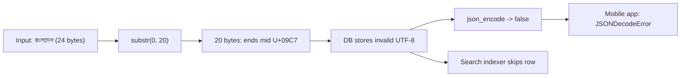
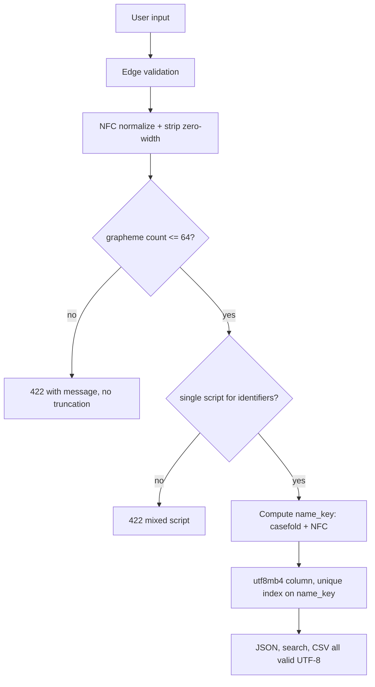

> **Scenario** — A signup form truncates display names to 20 characters using `substr($name, 0, 20)`. A user registers as `বাংলাদেশ প্রকৌশল বিশ্ববিদ্যালয়`. The stored value ends mid-sequence, the JSON API returns invalid UTF-8, and the mobile app crashes on `JSONDecodeError` for every screen that shows that user.

## Why it matters

- `substr` counts bytes, `strlen` counts bytes, and users count what they see. `বাংলাদেশ` is 24 bytes, 8 code points, and 4 grapheme clusters — three different "lengths", all defensible, none interchangeable.
- Invalid UTF-8 propagates. One truncated row breaks every downstream JSON encoder, search indexer, and CSV export that touches it.
- MySQL's `utf8` charset is actually `utf8mb3` and cannot store a 4-byte character. A single emoji in a support ticket produces `Incorrect string value: '\xF0\x9F\x98\x80'` and a failed insert.
- Two usernames can be visually identical and byte-different (`admin` with Latin `a` versus Cyrillic `а`, U+0430). That is an account-takeover vector, not a cosmetic issue.
- Collation decides uniqueness. Under `utf8mb4_0900_ai_ci`, `rene` and `René` collide on a unique index; under `utf8mb4_bin` they do not.

## Symptoms

| Signal | What you observe |
|---|---|
| Broken glyphs | `বাংলাদ\xE0\xA6` rendered as `বাংলাদ` + replacement character U+FFFD |
| JSON errors | `json_encode` returns `false` with `JSON_ERROR_UTF8` on specific rows only |
| Insert failures | `Incorrect string value: '\xF0\x9F\x98\x80' for column 'body'` |
| Length surprises | `'👨‍👩‍👧‍👦'.length === 11` in JS, while the user typed one character |
| Duplicate accounts | Two users with the same rendered name; `SELECT ... WHERE name = ?` matches neither |
| Search misses | Searching `café` finds nothing because the row is stored NFD (`cafe` + U+0301) |
| Sort order | Bengali names sorted by byte value, not by dictionary order |
| Silent data loss | A name is stored, but the last consonant conjunct is gone |

## How it breaks

Three distinct concepts get conflated: bytes, code points, and grapheme clusters. `বাংলাদেশ` is ব U+09AC, া U+09BE, ং U+0982, ল U+09B2, া U+09BE, দ U+09A6, ে U+09C7, শ U+09B6 — 8 code points, each 3 bytes in UTF-8, so 24 bytes. To a reader it is 4 units: বাং, লা, দে, শ. Truncating at 20 bytes cuts inside the 7th code point (U+09C7), leaving a lone continuation byte. Nothing throws at the truncation site; the error surfaces later, in a different service, as a decode failure.



## Root causes

1. Byte-oriented string functions (`substr`, `strlen`, `str_pad`) used on user text.
2. Column length limits expressed in bytes while validation counts characters.
3. MySQL `utf8` / `utf8mb3` instead of `utf8mb4`, on the column, the table, *and* the connection.
4. No normalization on input, so NFC and NFD forms of the same name are different rows.
5. No confusable/homoglyph check on identifiers such as usernames and slugs.
6. Uniqueness relying on a case- and accent-insensitive collation without anyone deciding that was the rule.
7. Truncation performed at the storage layer instead of validated and rejected at the edge.

## How to solve it

### 1. Count in grapheme clusters, truncate on cluster boundaries

```ts
function truncateGraphemes(input: string, max: number): string {
  const seg = new Intl.Segmenter('bn', { granularity: 'grapheme' })
  const out: string[] = []
  for (const { segment } of seg.segment(input)) {
    if (out.length >= max) break
    out.push(segment)
  }
  return out.join('')
}

const name = 'বাংলাদেশ'
console.log(new TextEncoder().encode(name).length)  // 24 bytes
console.log([...name].length)                        // 8 code points
console.log(truncateGraphemes(name, 3))              // 'বাংলা' — 3 clusters, valid

const family = '👨‍👩‍👧‍👦'
console.log(family.length)                           // 11 UTF-16 units
console.log([...family].length)                      // 7 code points
console.log(truncateGraphemes(family, 1))            // whole family, not half of it
```

Slicing a ZWJ sequence at code-point 4 produces `👨‍👩` — a different family. Grapheme boundaries are the only safe cut points for display text.

### 2. Make the whole path utf8mb4

```sql
ALTER DATABASE app CHARACTER SET utf8mb4 COLLATE utf8mb4_0900_ai_ci;

ALTER TABLE users
  MODIFY display_name VARCHAR(64)
  CHARACTER SET utf8mb4 COLLATE utf8mb4_0900_ai_ci NOT NULL;

-- Verify: any column still on a 3-byte charset is a landmine
SELECT table_name, column_name, character_set_name, collation_name
FROM information_schema.columns
WHERE table_schema = 'app'
  AND character_set_name IS NOT NULL
  AND character_set_name <> 'utf8mb4';
```

The connection charset matters as much as the column. In PHP:

```php
$pdo = new PDO('mysql:host=db;dbname=app;charset=utf8mb4', $user, $pass, [
    PDO::ATTR_ERRMODE => PDO::ERRMODE_EXCEPTION,
]);
```

Note that `VARCHAR(64)` in MySQL counts characters, but the index prefix limit counts bytes: 64 characters × 4 bytes = 256 bytes, which fits in the 3072-byte InnoDB limit, while a `VARCHAR(1000)` unique index does not.

### 3. Normalize on input, once, at the edge

```php
function normalizeName(string $raw): string
{
    if (!Normalizer::isNormalized($raw, Normalizer::FORM_C)) {
        $raw = Normalizer::normalize($raw, Normalizer::FORM_C);
    }
    // Strip zero-width characters that are invisible but change bytes
    $raw = preg_replace('/[\x{200B}\x{200C}\x{200D}\x{FEFF}]/u', '', $raw);
    return trim($raw);
}

// 'café' NFC  = 5 code points, 6 bytes (U+00E9)
// 'café' NFD  = 6 code points, 7 bytes (U+0065 U+0301)
// After NFC normalization both compare equal.
```

Be careful with ZWJ: stripping U+200D breaks legitimate emoji and some Indic conjuncts. Strip it in *identifier* fields (usernames, slugs), keep it in *display* and *content* fields.

### 4. Guard identifiers against confusables

```python
import unicodedata

LATIN_A, CYRILLIC_A = "a", "\u0430"

def scripts(s: str) -> set[str]:
    out = set()
    for ch in s:
        if ch.isalpha():
            name = unicodedata.name(ch, "")
            out.add(name.split()[0])  # 'LATIN', 'CYRILLIC', 'BENGALI'
    return out

def reject_mixed_script(username: str) -> None:
    found = scripts(username)
    if len(found) > 1:
        raise ValueError(f"mixed scripts in identifier: {sorted(found)}")

print(f"admin" == f"admin".replace(LATIN_A, CYRILLIC_A))  # False, looks identical
reject_mixed_script("аdmin")  # raises: {'CYRILLIC', 'LATIN'}
```

Single-script identifiers are fine; mixed-script ones almost never are.

### 5. Decide uniqueness explicitly

Add a generated `name_key` column holding the normalized, case-folded form, and put the unique index there. Then the uniqueness rule is code you can read and test, not a side effect of a collation default.

### 6. Validate at the edge, reject rather than truncate

If a name exceeds 64 grapheme clusters, return a 422 with a clear message. Silent truncation destroys data and hides the bug from the person who could fix it.

## Target design



## Tradeoffs

| Option | Pros | Cons | Choose when |
|---|---|---|---|
| Byte-length limits | Matches storage exactly | Cuts multi-byte text; user-hostile | Binary blobs only |
| Code-point limits | Simple, library-free | Splits emoji and Indic conjuncts | Internal identifiers |
| Grapheme-cluster limits | Matches what users see | Needs `Intl.Segmenter` or ICU | Any user-visible text field |
| NFC normalization | Consistent comparison and search | Loses the exact bytes the user sent | Names, search keys, identifiers |
| NFD storage | Preserves decomposed input | Longer, breaks naive `LIKE` matching | Interop with legacy macOS data |
| Accent-insensitive collation | Forgiving search | Unwanted uniqueness collisions | Search columns, not unique keys |
| Binary collation | Exact, predictable | Case-sensitive; no linguistic sort | Tokens, hashes, slugs |

## Verification checklist

- [ ] Test fixtures include `বাংলাদেশ`, `ক্ষ` (U+0995 U+09CD U+09B7), `👨‍👩‍👧‍👦`, `café` in both NFC and NFD, and a right-to-left name.
- [ ] `SELECT ... FROM information_schema.columns WHERE character_set_name <> 'utf8mb4'` returns zero user-data rows.
- [ ] Round-trip test: insert each fixture, read it back, assert byte equality.
- [ ] `json_encode` over the full table returns no `JSON_ERROR_UTF8`.
- [ ] A name of exactly 64 grapheme clusters is accepted; 65 returns 422, not a truncated row.
- [ ] Inserting `😀` into every free-text column succeeds.
- [ ] A mixed-script username registration attempt is rejected and logged.
- [ ] Sorting a list of Bengali names matches ICU collation output, not byte order.

## Anti-patterns

- `substr()` / `mb_substr()` with a byte count on display text.
- Setting only the table charset to `utf8mb4` and leaving the connection on `latin1`, so data is double-encoded (mojibake) rather than rejected.
- "Sanitizing" by stripping all non-ASCII, which deletes the entire name for most of the world.
- Using `LOWER()` for case-insensitive comparison on non-ASCII, which is locale-dependent and wrong for Turkish `İ`.
- Storing a UTF-16 length limit in a schema shared with a UTF-8 database.
- Relying on `LIKE '%café%'` to find NFD-stored rows.
- Fixing invalid UTF-8 by running the data through a lossy converter and calling it done, without fixing the truncation that produced it.

## Related

- [Money, rounding, and float traps](/systems/reliability-edge-cases/money-and-rounding-correctness)
- [Duplicate submission prevention](/systems/reliability-edge-cases/duplicate-submission-prevention)
- [Timezone and DST bugs that ship](/systems/reliability-edge-cases/timezone-and-dst-bugs)
