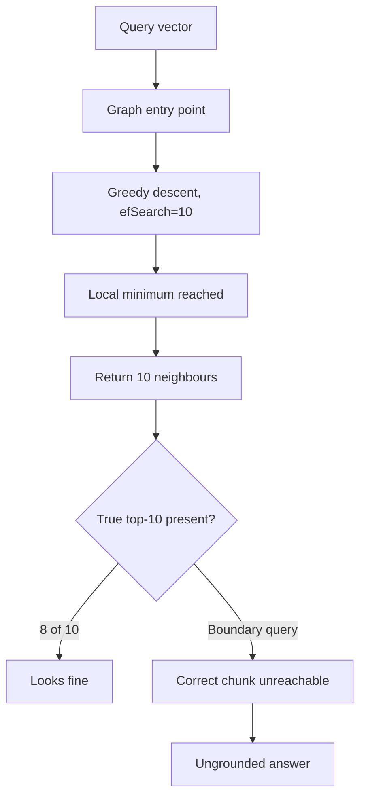
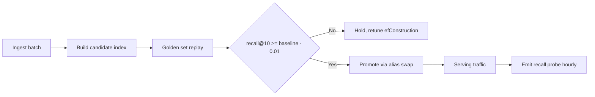

> **Scenario** — ৮M chunk রাখা একটি vector store ৪০০k-তে ঠিকই চলছিল। Bulk ingest-এর পরে search p95 latency ১৮ms থেকে ২৪০ms হলো আর answer quality পড়ে গেল, অথচ retrieval code কেউ বদলায়নি। Index default parameter দিয়ে rebuild হয়েছিল।

## Why it matters

- Approximate nearest neighbour index গঠনগতভাবেই recall-কে speed-এর বিনিময়ে ছাড়ে। কেউ ইচ্ছে করে trade না বাছলে library আপনার হয়ে বেছে নেয়।
- Recall loss নীরব। ANN index সবসময় `k`টি result দেয়; আসল top-10-এর তিনটি graph-এ অগম্য ছিল — এটা সে কখনো জানায় না।
- Index parameter memory-র সাথে জড়িত। ১০২৪ dimension-এর ৮M vector-এ `M=64` HNSW-তে শুধু vector-এর জন্যই প্রায় ৩৩GB লাগে, graph overhead ছাড়া।
- Rebuild আচরণ বদলায়। একই vector ভিন্ন ক্রমে insert করলে ভিন্ন graph আর ভিন্ন recall profile তৈরি হয়।
- Retrieval latency user-visible turn-এর ভেতরে বসে। ২৪০ms p95, ৪০ms reranker আর ২.৫s generation ধরলে retrieval এখন budget-এর ০.৭% নয়, ৮%।

## Symptoms

| Signal | What you observe |
|---|---|
| Latency | corpus বাড়ার সাথে search p95 superlinearly ওঠে |
| Recall | exact search-এর তুলনায় offline `recall@10` ০.৯৮ থেকে ০.৮২ |
| Memory | ingest-এর সময় pod RSS request limit ছাড়িয়ে OOM kill |
| Ingest | graph বড় হতে হতে insert throughput ৪k/s থেকে ৩০০/s |
| Filtering | tenant filter দিলে `k`-এর কম result আসে |

## How it breaks

HNSW স্তরযুক্ত proximity graph বানায়। `M` প্রতি node-এ bidirectional link-এর সংখ্যা ঠিক করে; `efConstruction` insert-এর সময় কতগুলো candidate দেখা হবে; `efSearch` query-এর সময় কতগুলো। Default `efSearch` প্রায়ই `k`-এর সমান, মানে search প্রায় explore-ই করে না। ৪০০k vector-এ graph যথেষ্ট ঘন, greedy descent তবু ঠিক এলাকায় পৌঁছায়। ৮M-এ পৌঁছায় না, search local minimum-এ থেমে যায়।

IVF-এর failure ভিন্ন। সে vector-দের `nlist` Voronoi cell-এ ভাগ করে আর কেবল `nprobe`টি probe করে। Query cell boundary-র কাছে হলে আসল nearest neighbour একটি unprobed cell-এ থাকে এবং কার্যত অদৃশ্য।



## Root causes

1. Index parameter library default-এ রয়ে গেছে, যা benchmark dataset-এর জন্য বাছা, আপনার corpus-এর জন্য নয়।
2. Corpus ২০ গুণ বাড়লেও `efSearch` কখনো বাড়ানো হয়নি।
3. Brute-force baseline-এর বিপরীতে recall কখনো মাপা হয়নি, তাই regression ধরার কোনো detector নেই।
4. Metadata filter post-search প্রয়োগ হয়, তাই আঁটসাঁট filter result set শুকিয়ে দেয়।
5. Ingest-এর সময় index rebuild হয়েছে, আগেরটার সাথে shadow comparison ছাড়াই।

## How to solve it

### 1. Brute-force recall baseline দাঁড় করান

৫০০টি golden query নিন, flat scan দিয়ে exact top-10 বের করুন, সংরক্ষণ করুন। এটাই চিরকালের ground truth।

```python
import numpy as np

def exact_top_k(q: np.ndarray, corpus: np.ndarray, k: int = 10) -> list[int]:
    qn = q / np.linalg.norm(q)
    cn = corpus / np.linalg.norm(corpus, axis=1, keepdims=True)
    sims = cn @ qn
    return np.argpartition(-sims, k)[:k][np.argsort(-sims[np.argpartition(-sims, k)[:k]])].tolist()

def recall_at_k(approx: list[int], exact: list[int]) -> float:
    return len(set(approx) & set(exact)) / len(exact)
```

### 2. Latency-র বিপরীতে `efSearch` sweep করুন

`efSearch` query-time knob — rebuild ছাড়াই বদলানো যায়। Sweep করে knee বেছে নিন।

```python
for ef in (16, 32, 64, 128, 256, 512):
    index.set_ef(ef)
    r = np.mean([recall_at_k(index.knn_query(q, k=10)[0][0].tolist(), gold[i])
                 for i, q in enumerate(queries)])
    print(f"efSearch={ef:4d}  recall@10={r:.3f}  p95={measure_p95(index, queries):.1f}ms")
```

৮M vector-এ প্রতিনিধিত্বমূলক আকার: `efSearch=16`-এ recall ০.৮২, ৯ms; `efSearch=128`-এ ০.৯৭, ৩১ms; `efSearch=512`-এ ০.৯৯, ১১০ms। Knee-র পরে ২ point recall-এর জন্য ৩ গুণ latency দিতে হয়।

### 3. Build parameter সচেতনভাবে বাছুন

| Knob | Effect | Typical range |
|---|---|---|
| `M` | graph degree; বেশি = ভালো recall, বেশি memory | 16–64 |
| `efConstruction` | build-time exploration; বেশি = ভালো graph, ধীর ingest | 100–512 |
| `efSearch` | query-time exploration; recall/latency dial | 32–512 |
| `nlist` (IVF) | cell সংখ্যা; মোটামুটি নিয়ম `4 * sqrt(N)` | 4k–65k |
| `nprobe` (IVF) | প্রতি query-তে probe করা cell | 8–128 |

HNSW-এর memory হিসাব: `bytes ≈ N * (d * 4 + M * 2 * 4)`। `N=8e6`, `d=1024`, `M=32` হলে `8e6 * (4096 + 256) ≈ 34.8GB`। int8-এ quantise করলে vector অংশ ৪ গুণ কমে প্রায় ৯.৯GB হয়, সাধারণত ১–৩ recall point-এর বিনিময়ে।

### 4. Tenancy-তে pre-filtered search ব্যবহার করুন

Post-filtering `k`টি result scan করে তারপর filter-এ ব্যর্থগুলো ফেলে দেয়। Corpus-এর ০.২% যে tenant-এর, তার জন্য `k=50` কার্যত শূন্য row দেয়। Filtered traversal সমর্থন করে এমন index নিন, বা tenant অনুযায়ী shard করুন।

```python
res = collection.query(
    vector=qv, top_k=50,
    filter={"tenant_id": {"$eq": tenant}, "lang": {"$in": ["en", "bn"]}},
)
```

### 5. প্রতিটি rebuild shadow-read করুন

নতুন index পুরনোটার পাশে বানান, দুটোতেই golden set চালান, আর `recall@10` ০.০১-এর মধ্যে ও p95 না বাড়লে তবেই promote করুন।

## Target design



## Tradeoffs

| Option | Pros | Cons | Choose when |
|---|---|---|---|
| Flat / exact | নিখুঁত recall, tuning লাগে না | প্রতি query O(N); ~1M-এর পরে অচল | corpus কয়েক লাখ vector-এর নিচে |
| HNSW | চমৎকার recall/latency, incremental insert | বেশি memory; delete মানে tombstone | latency-sensitive serving, RAM আছে |
| IVF-Flat | কম memory, দ্রুত build | boundary miss; training data লাগে | বড় corpus, batch-ধাঁচের query |
| IVF-PQ | খুব compact, বিশাল corpus | quantisation error recall খায় | কোটি কোটি vector, খরচই মুখ্য |
| Per-tenant shard | পরিষ্কার filtering, ছোট index | অনেক index চালাতে হয় | কড়া tenant isolation দরকার |

## Verification checklist

- [ ] Live index-এ frozen ৫০০-query set-এ brute force-এর বিপরীতে `recall@10` মাপা হয়েছে।
- [ ] প্রতিটি ধাপের latency সহ `efSearch` sweep রেকর্ড এবং নির্বাচিত মান নথিভুক্ত।
- [ ] Memory footprint হিসাব করে pod memory limit-এর সাথে ৩০% headroom রেখে মেলানো হয়েছে।
- [ ] সিস্টেমের সবচেয়ে ছোট tenant-এর জন্যও filtered query পূর্ণ `k` ফেরত দেয়।
- [ ] Promote-এর আগে rebuild আগের index-এর সাথে shadow-compare করা হয়েছে।
- [ ] ০.০৩-এর বেশি recall পতনে alert দেয় এমন hourly probe চালু।

## Anti-patterns

- ANN recall-কে tuned parameter নয়, database-এর ধ্রুব বৈশিষ্ট্য ভাবা।
- `efSearch` নামের বিনামূল্যের query-time knob থাকতে recall ঠিক করতে `M` বাড়ানো।
- ৫০k vector-এ benchmark করে ৮M-এ extrapolate করা — graph behaviour linear নয়।
- Compaction ছাড়া অনবরত delete ও re-add, ফলে graph tombstone-এ ভরে যায়।
- দুটি index configuration আলাদা query set-এ তুলনা করা।

## Related

- [Hybrid search and reranking that actually lifts recall](/systems/ai-rag-agents/hybrid-search-and-reranking)
- [Embedding model migration without a retrieval blackout](/systems/ai-rag-agents/embedding-model-migration)
- [Eval harness design for LLM features in CI](/systems/ai-rag-agents/eval-harness-design)
