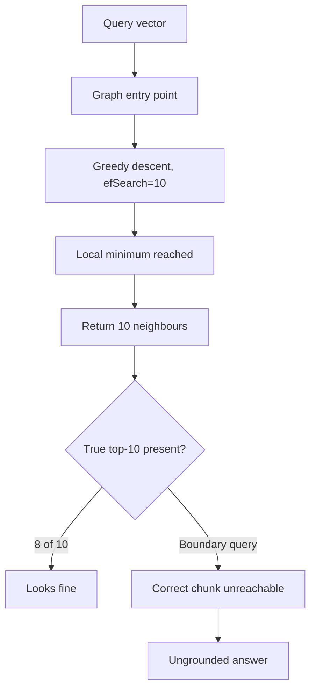
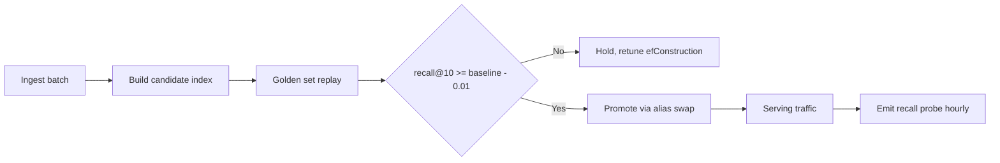

> **Scenario** - A vector store holding 8M chunks was fine at 400k. After a bulk ingest, p95 search latency went from 18ms to 240ms and answer quality dropped, but nobody changed the retrieval code. The index was rebuilt with default parameters.

## Why it matters

- Approximate nearest neighbour indexes trade recall for speed by construction. If nobody chose the trade explicitly, the library chose it for you.
- Recall loss is silent. An ANN index always returns `k` results; it never reports that three of the true top-10 were unreachable in the graph.
- Index parameters interact with memory. HNSW at `M=64` over 8M vectors of 1024 dimensions needs roughly 33GB for the vectors alone, before graph overhead.
- Rebuilds change behaviour. Re-inserting the same vectors in a different order produces a different graph and a different recall profile.
- Retrieval latency sits inside the user-visible turn. At 240ms p95 with a 40ms reranker and a 2.5s generation, retrieval is now 8% of the budget instead of 0.7%.

## Symptoms

| Signal | What you observe |
|---|---|
| Latency | Search p95 climbs superlinearly with corpus size |
| Recall | Offline `recall@10` versus exact search falls from 0.98 to 0.82 |
| Memory | Pod RSS grows past the request limit and the OOM killer fires during ingest |
| Ingest | Insert throughput collapses as the graph grows, from 4k/s to 300/s |
| Filtering | Adding a tenant filter returns fewer than `k` results |

## How it breaks

HNSW builds a layered proximity graph. `M` sets the number of bidirectional links per node; `efConstruction` sets how many candidates are explored while inserting; `efSearch` sets how many are explored at query time. Default `efSearch` is often equal to `k`, which means the search barely explores at all. At 400k vectors the graph is dense enough that greedy descent still lands on the right neighbourhood. At 8M it does not, and the search terminates in a local minimum.

IVF has a different failure. It partitions vectors into `nlist` Voronoi cells and probes only `nprobe` of them. If the query sits near a cell boundary, the true nearest neighbour is in an unprobed cell and is simply invisible.



## Root causes

1. Index parameters were left at library defaults chosen for benchmark datasets, not for your corpus size.
2. `efSearch` was never raised as the corpus grew by 20x.
3. Recall against an exact brute-force baseline was never measured, so the regression had no detector.
4. Metadata filters are applied post-search, so aggressive filters starve the result set.
5. The index was rebuilt during ingest without a shadow comparison against the previous one.

## How to solve it

### 1. Establish a brute-force recall baseline

Take 500 golden queries, compute exact top-10 with a flat scan, and store them. This is your ground truth forever.

```python
import numpy as np

def exact_top_k(q: np.ndarray, corpus: np.ndarray, k: int = 10) -> list[int]:
    qn = q / np.linalg.norm(q)
    cn = corpus / np.linalg.norm(corpus, axis=1, keepdims=True)
    sims = cn @ qn
    return np.argpartition(-sims, k)[:k][np.argsort(-sims[np.argpartition(-sims, k)[:k]])].tolist()

def recall_at_k(approx: list[int], exact: list[int]) -> float:
    return len(set(approx) & set(exact)) / len(exact)
```

### 2. Sweep `efSearch` against latency

`efSearch` is a query-time knob - you can change it without rebuilding. Sweep it and pick the knee.

```python
for ef in (16, 32, 64, 128, 256, 512):
    index.set_ef(ef)
    r = np.mean([recall_at_k(index.knn_query(q, k=10)[0][0].tolist(), gold[i])
                 for i, q in enumerate(queries)])
    print(f"efSearch={ef:4d}  recall@10={r:.3f}  p95={measure_p95(index, queries):.1f}ms")
```

A representative shape at 8M vectors: `efSearch=16` gives recall 0.82 at 9ms; `efSearch=128` gives 0.97 at 31ms; `efSearch=512` gives 0.99 at 110ms. Beyond the knee you pay 3x latency for 2 points of recall.

### 3. Choose build parameters deliberately

| Knob | Effect | Typical range |
|---|---|---|
| `M` | Graph degree; higher = better recall, more memory | 16–64 |
| `efConstruction` | Build-time exploration; higher = better graph, slower ingest | 100–512 |
| `efSearch` | Query-time exploration; the recall/latency dial | 32–512 |
| `nlist` (IVF) | Number of cells; rule of thumb `4 * sqrt(N)` | 4k–65k |
| `nprobe` (IVF) | Cells probed per query | 8–128 |

Memory arithmetic for HNSW: `bytes ≈ N * (d * 4 + M * 2 * 4)`. At `N=8e6`, `d=1024`, `M=32`: `8e6 * (4096 + 256) ≈ 34.8GB`. Quantising to int8 cuts the vector term by 4x to about 9.9GB, at a typical cost of 1–3 recall points.

### 4. Use pre-filtered search for tenancy

Post-filtering scans `k` results and then drops the ones that fail the filter. With a tenant that owns 0.2% of the corpus, `k=50` returns roughly zero rows. Use an index that supports filtered traversal, or shard per tenant.

```python
res = collection.query(
    vector=qv, top_k=50,
    filter={"tenant_id": {"$eq": tenant}, "lang": {"$in": ["en", "bn"]}},
)
```

### 5. Shadow-read every rebuild

Build the new index alongside the old, run the golden set against both, and only promote when `recall@10` is within 0.01 and p95 has not regressed.

## Target design



## Tradeoffs

| Option | Pros | Cons | Choose when |
|---|---|---|---|
| Flat / exact | Perfect recall, no tuning | O(N) per query; unusable past ~1M | Corpus under a few hundred thousand vectors |
| HNSW | Excellent recall/latency, incremental inserts | High memory; deletes are tombstones | Latency-sensitive serving with RAM budget |
| IVF-Flat | Low memory, fast build | Boundary misses; needs training data | Large corpus, batch-ish query patterns |
| IVF-PQ | Very compact, huge corpora | Quantisation error costs recall | Billions of vectors, cost-dominated |
| Per-tenant shards | Clean filtering, small indexes | Many indexes to operate | Strong tenant isolation requirements |

## Verification checklist

- [ ] `recall@10` versus brute force measured on a frozen 500-query set for the live index.
- [ ] `efSearch` sweep recorded with latency at each step, and the chosen value documented.
- [ ] Memory footprint calculated and compared against the pod memory limit with 30% headroom.
- [ ] Filtered queries return a full `k` for the smallest tenant in the system.
- [ ] A rebuild has been shadow-compared against the previous index before promotion.
- [ ] Hourly recall probe alerting on a drop greater than 0.03.

## Anti-patterns

- Treating ANN recall as a constant property of the database rather than a tuned parameter.
- Raising `M` to fix recall when `efSearch` is the free query-time knob.
- Benchmarking on 50k vectors and extrapolating to 8M - graph behaviour is not linear.
- Deleting and re-adding documents constantly without compaction, leaving the graph full of tombstones.
- Comparing two index configurations on different query sets.

## Related

- [Hybrid search and reranking that actually lifts recall](/systems/ai-rag-agents/hybrid-search-and-reranking)
- [Embedding model migration without a retrieval blackout](/systems/ai-rag-agents/embedding-model-migration)
- [Eval harness design for LLM features in CI](/systems/ai-rag-agents/eval-harness-design)
