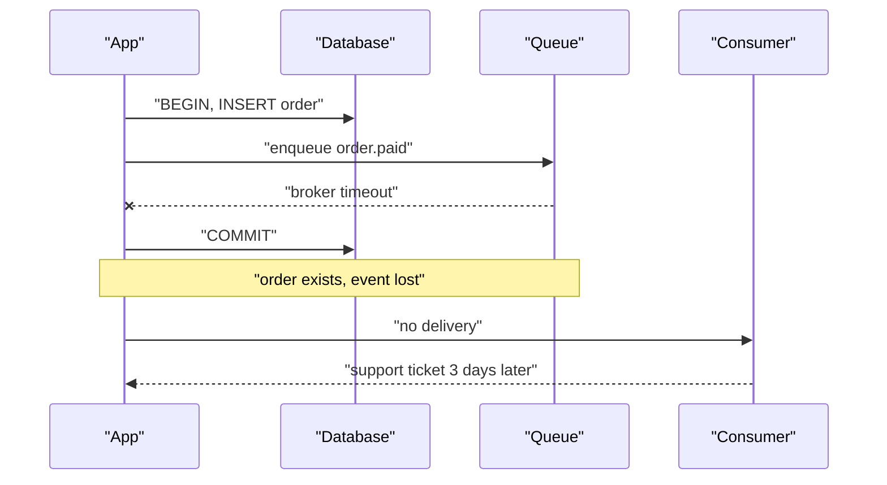
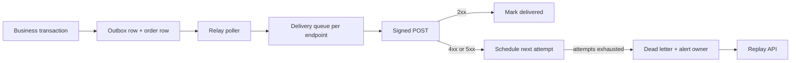

> **Scenario** - এক merchant-এর endpoint ৮ms-এ `200 OK` ফেরায়, কারণ তাদের framework প্রসেসিংয়ের আগেই acknowledge করে। তাদের queue জমে যায়, ৪০,০০০ `order.paid` event তাদের দিকে হারায়, আর তিন দিন পরে তারা ticket খুলে বলে আপনার webhook "কখনো fire করেনি"। আপনার log-এ ৪০,০০০ সফল delivery। Event-এ sequence number নেই, replay endpoint নেই - কেউ কিছু প্রমাণ করতে পারে না।

## Why it matters

- গ্রাহক তাদের ব্যবসা webhook-এর উপর দাঁড় করায়; হারানো `payment.succeeded` মানে অপূর্ণ order।
- Delivery বড়জোর at-least-once, তাই exactly-once ধরে নেওয়া consumer চুপচাপ নিজের data নষ্ট করে।
- Delivery worker যদি block করে, ধীর consumer endpoint backpressure দেয় *আপনার* system-এ, তাদের নয়।
- Unsigned webhook হলে URL জানা যে কেউ `subscription.cancelled` জাল করতে পারে।
- Replay না থাকলে প্রতিটি support আলাপ database প্রত্নতত্ত্বে পরিণত হয়।

## Symptoms

| Signal | What you observe |
| --- | --- |
| Consumer dispute | delivery log-এ `200`, তবু "আমরা পাইনি" |
| Worker starvation | ১২টি endpoint ২৫s করে নেয়, delivery queue depth বাড়ে |
| Duplicate processing | এক `order.paid`-এ consumer দুটি shipment বানায় |
| Out-of-order state | `order.paid`-এর আগে `order.refunded` আসে |
| Silent endpoint rot | endpoint ছয় সপ্তাহ `410 Gone` দেয়, কেউ খেয়াল করে না |
| Forged event | বৈধ shape কিন্তু ভিন্ন customer ID নিয়ে event আসে |

## How it breaks

সরল বাস্তবায়ন order তৈরির একই transaction-এ webhook post করে। HTTP call ধীর হলে transaction সেকেন্ডের পর সেকেন্ড lock ধরে রাখে। Post সফল হওয়ার পর transaction rollback হলে এমন order-এর event পাঠানো হলো যা নেই। Post fail করলে হয় event হারায়, নয় বৈধ order rollback হয়।

Delivery queue-তে সরালে transaction ঠিক হয়, কিন্তু dual-write সমস্যা আসে: order commit হয়, enqueue fail করে, event চিরতরে হারায়। Outbox pattern এটি সমাধান করে - business data-র *একই transaction-এ* event টেবিলে লেখা হয়।



## Root causes

1. Event যে transaction থেকে জন্মেছে তার বাইরে publish হয় (dual write)।
2. Delivery worker অন্য job-এর সাথে ভাগাভাগি হয়, তাই এক ধীর endpoint সবকিছু অনাহারে রাখে।
3. Signature নেই, তাই consumer origin যাচাই করতে পারে না, আপনিও authorship প্রমাণ করতে পারেন না।
4. Event ID বা sequence নেই, তাই consumer dedupe বা gap শনাক্ত করতে পারে না।
5. Retry হয় অসীম, নয় অনুপস্থিত - নির্ধারিত schedule কখনো নয়।
6. Consumer-এর কাছে request-এর ভেতরেই synchronous প্রসেসিং আশা করা হয়।
7. Replay API নেই, তাই recovery-র জন্য database access সহ engineer লাগে।

## How to solve it

### 1. একই transaction-এ outbox-এ event লিখুন

```sql
CREATE TABLE webhook_events (
    id            BIGSERIAL PRIMARY KEY,
    event_id      UUID        NOT NULL UNIQUE,
    tenant_id     BIGINT      NOT NULL,
    type          VARCHAR(64) NOT NULL,
    sequence      BIGINT      NOT NULL,
    payload       JSONB       NOT NULL,
    created_at    TIMESTAMPTZ NOT NULL DEFAULT now(),
    dispatched_at TIMESTAMPTZ
);

CREATE INDEX webhook_events_pending
    ON webhook_events (created_at)
    WHERE dispatched_at IS NULL;
```

```php
DB::transaction(function () use ($order) {
    $order->save();

    WebhookEvent::create([
        'event_id'  => (string) Str::uuid(),
        'tenant_id' => $order->tenant_id,
        'type'      => 'order.paid',
        'sequence'  => $order->tenant->nextWebhookSequence(),
        'payload'   => ['order_id' => $order->id, 'amount' => $order->total],
    ]);
});
```

একটি relay process partial index poll করে dispatch করে। Event ও order একসাথে commit হয়, নয়তো কোনোটাই নয়।

### 2. প্রতিটি delivery sign করুন

```php
<?php

namespace App\Webhooks;

use Illuminate\Support\Facades\Http;

class WebhookDispatcher
{
    public function deliver(Endpoint $endpoint, WebhookEvent $event, int $attempt): int
    {
        $body = json_encode([
            'id'         => $event->event_id,
            'type'       => $event->type,
            'sequence'   => $event->sequence,
            'created_at' => $event->created_at->toIso8601String(),
            'data'       => $event->payload,
        ], JSON_UNESCAPED_SLASHES);

        $timestamp = time();
        $signature = hash_hmac('sha256', "{$timestamp}.{$body}", $endpoint->secret);

        $response = Http::withHeaders([
            'Content-Type'        => 'application/json',
            'X-Webhook-Id'        => $event->event_id,
            'X-Webhook-Timestamp' => (string) $timestamp,
            'X-Webhook-Signature' => "v1={$signature}",
            'X-Webhook-Attempt'   => (string) $attempt,
        ])
            ->connectTimeout(2)
            ->timeout(10)
            ->withoutRedirecting()
            ->post($endpoint->url, [])
            ->throw();

        return $response->status();
    }
}
```

শুধু body নয়, `timestamp.body` sign করাই replay attack আটকায়; consumer পাঁচ মিনিটের পুরোনো কিছু reject করে।

### 3. Retry schedule প্রকাশ করুন এবং থামুন

চতুর schedule-এর চেয়ে নির্ধারিত ও নথিভুক্ত schedule ভালো, কারণ consumer সেটা ধরে পরিকল্পনা করতে পারে:

```
attempt 1  immediate
attempt 2  +30s
attempt 3  +2m
attempt 4  +10m
attempt 5  +1h
attempt 6  +6h
attempt 7  +24h   (final)
```

শেষ attempt-এর পর event dead letter টেবিলে সরান, endpoint degraded চিহ্নিত করুন, integration owner-কে email দিন। ২৪ ঘণ্টা একটানা fail করলে endpoint auto-disable করুন যাতে মৃত URL-এ worker না পোড়ে।

### 4. Consumer-কে সঠিক হওয়ার উপকরণ দিন

```ts
import { createHmac, timingSafeEqual } from 'node:crypto'

const TOLERANCE_SECONDS = 300

export function verifyWebhook(
  rawBody: string,
  headers: Record<string, string>,
  secret: string,
): boolean {
  const timestamp = Number(headers['x-webhook-timestamp'])
  if (!Number.isFinite(timestamp)) return false
  if (Math.abs(Date.now() / 1000 - timestamp) > TOLERANCE_SECONDS) return false

  const expected = createHmac('sha256', secret)
    .update(`${timestamp}.${rawBody}`)
    .digest('hex')

  const provided = (headers['x-webhook-signature'] ?? '').replace('v1=', '')
  if (provided.length !== expected.length) return false

  return timingSafeEqual(Buffer.from(expected), Buffer.from(provided))
}
```

সঠিক consumer আচরণ স্পষ্ট লিখুন: verify করুন, `X-Webhook-Id` ধরে persist করুন, ৫ সেকেন্ডের মধ্যে `2xx` দিন, প্রসেসিং asynchronous করুন। জানিয়ে দিন event out of order আসতে পারে এবং stale state বাদ দিতে `sequence` ব্যবহার করতে হবে।

### 5. Replay endpoint ship করুন

`POST /v1/webhook_endpoints/{id}/replay` - time range ও ঐচ্ছিক event type সহ। এটি তিন দিনের support thread-কে এক মিনিটের self-service কাজে বদলে দেয়।

## Target design



## Tradeoffs

| Option | Pros | Cons | Choose when |
| --- | --- | --- | --- |
| Outbox + relay | event হারায় না, transactional | বাড়তি টেবিল, ~১s polling lag | টাকা সংক্রান্ত যেকোনো event |
| Handler-এ সরাসরি publish | সবচেয়ে সরল | dual-write loss window | কম গুরুত্বের notification |
| Per-endpoint queue | এক ধীর consumer অন্যদের আটকায় না | বেশি queue infrastructure | বহু third-party consumer |
| Ordered delivery | consumer-এর কম যুক্তি লাগে | head-of-line blocking, scale কঠিন | কম volume, কড়া ordering |
| Webhook-এর বদলে polling API | consumer গতি নিয়ন্ত্রণ করে, signing লাগে না | latency ও request বেশি | firewall-এর পেছনের consumer |

## Verification checklist

- [ ] Order commit ও dispatch-এর মাঝে app kill করে দেখুন restart-এর পরও event delivered হয়।
- [ ] একটি endpoint ৩০s ঘুমানো stub-এ পাঠিয়ে যাচাই করুন বাকি endpoint চলতে থাকে।
- [ ] Body-র এক byte বদলে signature verification fail হয় কিনা দেখুন।
- [ ] ১৫ মিনিটের window replay করে consumer `X-Webhook-Id` দিয়ে dedupe করছে কিনা নিশ্চিত করুন।
- [ ] সাত attempt `500` দিয়ে দেখুন event নথিভুক্ত timing মেনে dead letter টেবিলে যায়।
- [ ] ২৪ ঘণ্টা fail করা endpoint auto-disable ও owner notified হচ্ছে কিনা যাচাই করুন।

## Anti-patterns

- Database transaction-এর ভেতরে webhook পাঠানো, যা third-party HTTP call-এর পুরো সময় row lock ধরে রাখে।
- শুধু body sign করা, যাতে আক্রমণকারী ধরা request চিরকাল replay করতে পারে।
- `410 Gone` ও `404` retry করা - endpoint আপনাকে থামতে বলছে।
- `2xx`-কে "processed" ধরা, যেখানে সাধারণত এর মানে "received"।
- Payload-এ সংবেদনশীল data দেওয়া, ID দিয়ে authenticated API থেকে fetch করানোর বদলে।
- যে ordering দিতে পারবেন না তার প্রতিশ্রুতি দেওয়া, তারপর parallel worker event reorder করছে আবিষ্কার করা।

## Related

- [Idempotency keys for payment APIs](/systems/api-integration/idempotency-keys-for-payments)
- [Retry with jitter, budgets, and honest error classes](/systems/api-integration/retry-with-jitter-strategy)
- [Contract testing across team boundaries](/systems/api-integration/contract-testing-across-teams)
