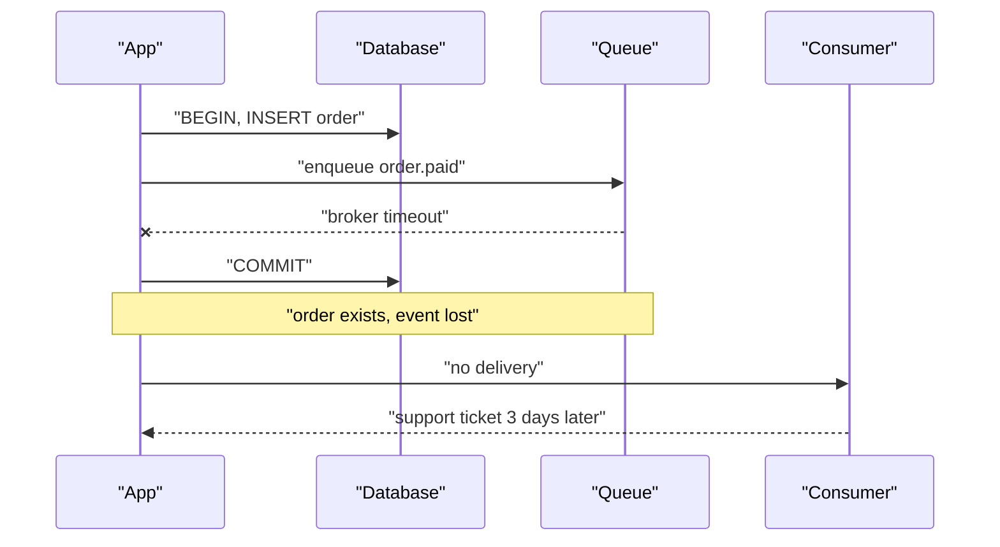
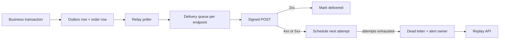

> **Scenario** - A merchant's endpoint returns `200 OK` in 8ms because their framework acknowledges before processing. Their queue backs up, 40,000 `order.paid` events are dropped on their side, and three days later they open a ticket claiming your webhooks "never fired". Your logs show 40,000 successful deliveries. Neither side can prove anything because the events carry no sequence number and no replay endpoint exists.

## Why it matters

- Webhooks are the integration surface customers build their business on; a lost `payment.succeeded` means an unfulfilled order.
- Delivery is at-least-once at best, so consumers who assume exactly-once quietly corrupt their own data.
- A slow consumer endpoint applies backpressure to *your* system, not theirs, if your delivery workers block on it.
- Unsigned webhooks let anyone with the URL forge a `subscription.cancelled` event.
- Without replay, every support conversation becomes a database archaeology project.

## Symptoms

| Signal | What you observe |
| --- | --- |
| Consumer disputes | "We never got it" against delivery logs showing `200` |
| Worker starvation | Delivery queue depth grows because 12 endpoints take 25s each |
| Duplicate processing | Consumer creates two shipments for one `order.paid` |
| Out-of-order state | `order.refunded` arrives before `order.paid` |
| Silent endpoint rot | An endpoint returns `410 Gone` for six weeks and nobody notices |
| Forged events | An event arrives with a valid shape and a customer ID that is not yours |

## How it breaks

The naive implementation posts the webhook inside the same transaction that created the order. If the HTTP call is slow, the transaction holds locks for seconds. If the transaction rolls back after the post succeeds, you have sent an event for an order that does not exist. If the post fails, you either lose the event or roll back a valid order.

Moving delivery to a queue fixes the transaction, but introduces the dual-write problem: the order commits, the enqueue fails, and the event is gone forever. The outbox pattern solves this by writing the event to a table *in the same transaction* as the business data.



## Root causes

1. Events are published outside the transaction that produced them (dual write).
2. Delivery workers are shared with other jobs, so one slow endpoint starves everything.
3. No signature, so consumers cannot verify origin and you cannot prove authorship.
4. No event ID or sequence number, so consumers cannot dedupe or detect gaps.
5. Retries are unbounded or nonexistent - never a defined schedule.
6. Consumers are expected to process synchronously inside the request.
7. There is no replay API, so recovery requires an engineer with database access.

## How to solve it

### 1. Write events to an outbox in the same transaction

```sql
CREATE TABLE webhook_events (
    id            BIGSERIAL PRIMARY KEY,
    event_id      UUID        NOT NULL UNIQUE,
    tenant_id     BIGINT      NOT NULL,
    type          VARCHAR(64) NOT NULL,
    sequence      BIGINT      NOT NULL,
    payload       JSONB       NOT NULL,
    created_at    TIMESTAMPTZ NOT NULL DEFAULT now(),
    dispatched_at TIMESTAMPTZ
);

CREATE INDEX webhook_events_pending
    ON webhook_events (created_at)
    WHERE dispatched_at IS NULL;
```

```php
DB::transaction(function () use ($order) {
    $order->save();

    WebhookEvent::create([
        'event_id'  => (string) Str::uuid(),
        'tenant_id' => $order->tenant_id,
        'type'      => 'order.paid',
        'sequence'  => $order->tenant->nextWebhookSequence(),
        'payload'   => ['order_id' => $order->id, 'amount' => $order->total],
    ]);
});
```

A relay process polls the partial index and dispatches. The event and the order commit together or not at all.

### 2. Sign every delivery

```php
<?php

namespace App\Webhooks;

use Illuminate\Support\Facades\Http;

class WebhookDispatcher
{
    public function deliver(Endpoint $endpoint, WebhookEvent $event, int $attempt): int
    {
        $body = json_encode([
            'id'         => $event->event_id,
            'type'       => $event->type,
            'sequence'   => $event->sequence,
            'created_at' => $event->created_at->toIso8601String(),
            'data'       => $event->payload,
        ], JSON_UNESCAPED_SLASHES);

        $timestamp = time();
        $signature = hash_hmac('sha256', "{$timestamp}.{$body}", $endpoint->secret);

        $response = Http::withHeaders([
            'Content-Type'        => 'application/json',
            'X-Webhook-Id'        => $event->event_id,
            'X-Webhook-Timestamp' => (string) $timestamp,
            'X-Webhook-Signature' => "v1={$signature}",
            'X-Webhook-Attempt'   => (string) $attempt,
        ])
            ->connectTimeout(2)
            ->timeout(10)
            ->withoutRedirecting()
            ->post($endpoint->url, [])
            ->throw();

        return $response->status();
    }
}
```

Signing `timestamp.body` rather than the body alone is what blocks replay attacks; consumers reject anything older than five minutes.

### 3. Publish the retry schedule and stop

A fixed, documented schedule is better than a clever one because consumers can plan around it:

```
attempt 1  immediate
attempt 2  +30s
attempt 3  +2m
attempt 4  +10m
attempt 5  +1h
attempt 6  +6h
attempt 7  +24h   (final)
```

After the final attempt, move the event to a dead letter table, mark the endpoint degraded, and email the integration owner. Auto-disable an endpoint after 24 hours of continuous failure so you stop burning workers on a dead URL.

### 4. Give consumers what they need to be correct

```ts
import { createHmac, timingSafeEqual } from 'node:crypto'

const TOLERANCE_SECONDS = 300

export function verifyWebhook(
  rawBody: string,
  headers: Record<string, string>,
  secret: string,
): boolean {
  const timestamp = Number(headers['x-webhook-timestamp'])
  if (!Number.isFinite(timestamp)) return false
  if (Math.abs(Date.now() / 1000 - timestamp) > TOLERANCE_SECONDS) return false

  const expected = createHmac('sha256', secret)
    .update(`${timestamp}.${rawBody}`)
    .digest('hex')

  const provided = (headers['x-webhook-signature'] ?? '').replace('v1=', '')
  if (provided.length !== expected.length) return false

  return timingSafeEqual(Buffer.from(expected), Buffer.from(provided))
}
```

Document the correct consumer shape explicitly: verify, persist by `X-Webhook-Id`, return `2xx` within 5 seconds, process asynchronously. Tell them events may arrive out of order and to use `sequence` to discard stale state.

### 5. Ship a replay endpoint

`POST /v1/webhook_endpoints/{id}/replay` with a time range and optional event types. This turns a three-day support thread into a one-minute self-service action.

## Target design



## Tradeoffs

| Option | Pros | Cons | Choose when |
| --- | --- | --- | --- |
| Outbox + relay | No lost events, transactional | Extra table, polling lag of ~1s | Any event that affects money |
| Direct publish in handler | Simplest | Dual-write loss window | Non-critical notifications |
| Per-endpoint queues | One slow consumer cannot starve others | More queue infrastructure | Many third-party consumers |
| Ordered delivery | Consumers need less logic | Head-of-line blocking, hard to scale | Small volume, strict ordering |
| Polling API instead of webhooks | Consumer controls pace, no signing | Higher latency, more requests | Consumers behind firewalls |

## Verification checklist

- [ ] Kill the app between order commit and dispatch; confirm the event still delivers after restart.
- [ ] Point an endpoint at a stub that sleeps 30s and verify other endpoints keep flowing.
- [ ] Tamper with one byte of the body and confirm signature verification fails.
- [ ] Replay a 15-minute window and confirm consumers dedupe by `X-Webhook-Id`.
- [ ] Return `500` for seven attempts and confirm the event lands in the dead letter table with the documented timing.
- [ ] Confirm an endpoint failing for 24 hours is auto-disabled and its owner notified.

## Anti-patterns

- Sending the webhook inside the database transaction, holding row locks for the duration of a third-party HTTP call.
- Signing only the body, allowing an attacker to replay a captured request forever.
- Retrying `410 Gone` and `404` - the endpoint is telling you to stop.
- Treating `2xx` as "processed" when it usually means "received".
- Putting sensitive data in the payload instead of an ID the consumer fetches over an authenticated API.
- Promising ordering you cannot deliver, then discovering parallel workers reorder events.

## Related

- [Idempotency keys for payment APIs](/systems/api-integration/idempotency-keys-for-payments)
- [Retry with jitter, budgets, and honest error classes](/systems/api-integration/retry-with-jitter-strategy)
- [Contract testing across team boundaries](/systems/api-integration/contract-testing-across-teams)
