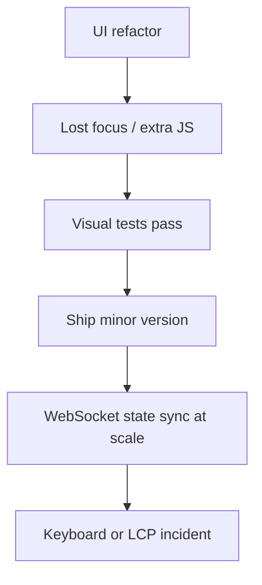

> **Lesson 40 · intermediate** - Reconnect storms, missed events, and reconciling UI state with server cursors.

## Why it matters

- A Vue 3 + Quasar screen that looks finished still drops focus, ships a 900 kB route, or shows yesterday’s Pinia state after a deploy.
- Component contracts multiply. One modal, one table, or one store leak becomes every product that imports the package.
- Visual QA never sees keyboard traps, hydration mismatch, or a waterfall of lazy chunks.
- This lesson is specifically about **WebSocket state sync at scale**. Tags: websocket, realtime, frontend.

## Symptoms

| Signal | What you observe |
| --- | --- |
| Focus / a11y | Tab leaves the dialog, or a screen reader only says “button” |
| Bundle | A lazy route still downloads the whole dashboard |
| Stale UI | Pinia shows cached rows after the Laravel write succeeded |
| Hydration | Server HTML and client Vue tree disagree on first paint |

## How it breaks



The named technology is rarely the villain. Two code paths (often a Vue/Quasar screen and a Laravel write) assume opposite contracts. Production finds the race. For this topic that contract is: Reconnect storms, missed events, and reconciling UI state with server cursors.

## Root causes

1. Accessibility and focus restore lived in markup, not in a tested composable.
2. Route-level code splitting imported a barrel file that pulled Chart.js into every page.
3. Pinia stored API payloads as the source of truth instead of a server-cache plus local UI state.
4. No axe or keyboard-only check in CI, so refactors deleted ARIA with a green build.

## How to solve it

### 1. Write the invariant in one sentence

Reconnect storms, missed events, and reconciling UI state with server cursors. Put that sentence in the PR, the Pinia action, and the Laravel class.

### 2. Guard the edge in code

```ts
// composables/useFocusTrap.ts
export function useFocusTrap(panel: Ref<HTMLElement | null>, onClose: () => void) {
  const SELECTOR = 'a[href],button:not([disabled]),input,select,textarea,[tabindex]:not([tabindex="-1"])'
  function onKey(e: KeyboardEvent) {
    if (e.key === 'Escape') return onClose()
    if (e.key !== 'Tab' || !panel.value) return
    const nodes = [...panel.value.querySelectorAll<HTMLElement>(SELECTOR)]
    const first = nodes[0]
    const last = nodes.at(-1)
    if (!first || !last) return
    if (e.shiftKey && document.activeElement === first) { e.preventDefault(); last.focus() }
    else if (!e.shiftKey && document.activeElement === last) { e.preventDefault(); first.focus() }
  }
  onMounted(() => document.addEventListener('keydown', onKey))
  onUnmounted(() => document.removeEventListener('keydown', onKey))
}
```

```php
// routes/web.php — keep the JSON contract tiny so the Vue chunk stays lazy
Route::get('/api/tickets/{ticket}', function (Ticket $ticket) {
    return $ticket->only(['id', 'title', 'status', 'updated_at']);
});
```

### 3. Keep a chart you will actually look at

LCP, JS transferred per route, and axe violations per deploy. If the chart cannot catch a regression in **WebSocket state sync at scale**, the lesson is not done.

## Worked example

A Quasar dialog refactor swapped `<q-dialog>` internals for a teleported div. Mouse users saw nothing. Keyboard users tabbed into the page behind it. A 12-line focus-trap composable plus an axe check in CI closed the hole for every screen that reused the dialog.

On this topic, start from the symptom in the table that matches your last incident, then walk the diagram until the guard above would have fired.

## Check before you ship

- [ ] The invariant for **WebSocket state sync at scale** is written in one sentence.
- [ ] Empty, duplicate, timeout, or permission paths have a test or a staged rehearsal.
- [ ] A dashboard or log query would catch a regression within one deploy.
- [ ] Related reading still makes sense: micro-packaging-modules.

## What not to do

- Copy a blog snippet that retries forever or caches the error as success.
- Treat Pinia as the source of truth for a Laravel row.
- Skip the previous numbered lesson if this one feels dense — the path is beginner → intermediate → advanced on purpose.
