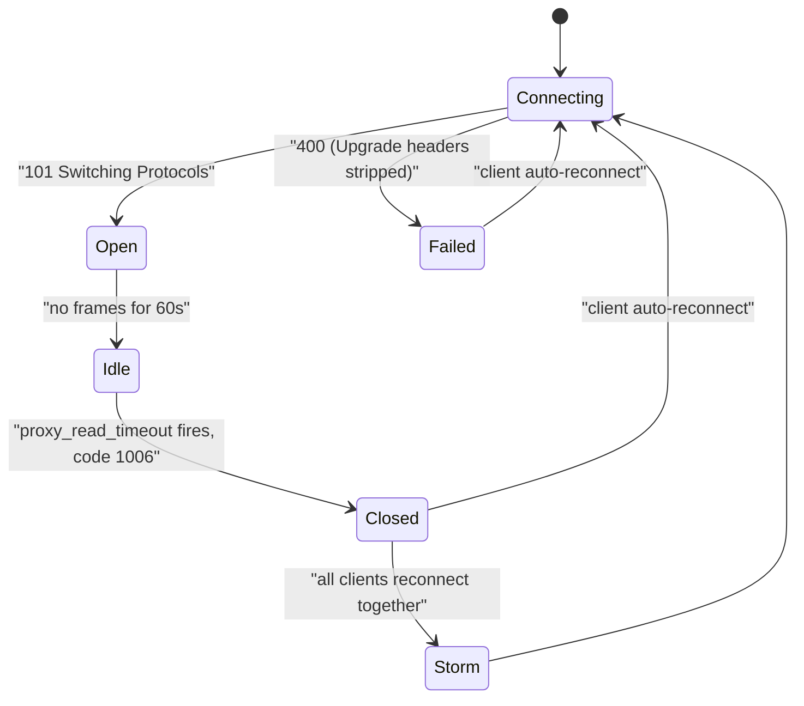
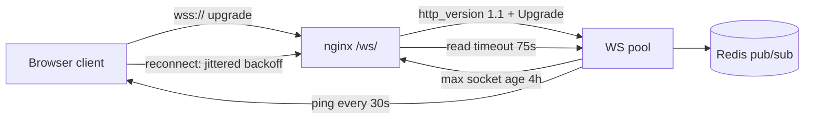

> **Scenario** - একটি collaborative editor localhost-এ নিখুঁত চলে। production-এ প্রতিটি client ৬০ সেকেন্ড ছন্দে disconnect ও reconnect করে, অনন্তকাল। ৪,০০০ user-এর জন্য backend মিনিটে ৪,০০০ WebSocket handshake দেখে, session setup-এ CPU আটকে যায়, আর "presence" feature সবার জন্য জ্বলে-নেভে।

## Why it matters

- প্রতি ৬০ সেকেন্ডে reconnect মানে প্রতিটি client আবার authenticate, subscribe ও state sync করে - chat feature একটি load generator হয়ে ওঠে।
- reconnect storm নিজেই নিজেকে বাড়ায়: deploy-এর পর সবাই একই সেকেন্ডে connect করেছিল, তাই সবাই একই সেকেন্ডে disconnect করে।
- এখানে proxy misconfiguration application code-এ অদৃশ্য; app সঠিক, তবু শুধু production-এ fail করে।
- buffering ছোট frame গিলে ফেলে, তাই "message দেরিতে গুচ্ছ আকারে আসে" ভুল করে broker বা application সমস্যা হিসেবে ধরা হয়।
- WebSocket connection একবারই balance হয়, connect time-এ - খারাপ distribution connection-এর সারা জীবন থাকে।

## Symptoms

| Signal | What you observe |
| --- | --- |
| Browser console | প্রতি ~৬০s-এ `WebSocket is closed before the connection is established` বা close code 1006 |
| nginx `error.log` | `upstream prematurely closed connection while reading upstream` |
| Handshake response | `101 Switching Protocols`-এর বদলে `HTTP/1.1 400 Bad Request` |
| Connection lifetime histogram | ঠিক 60s বা 300s-এ তীক্ষ্ণ spike |
| Backend | handshake rate ≈ user সংখ্যা ÷ idle timeout |
| Message delivery | frame ধারাবাহিক নয়, ঝাঁকে আসে |
| Pod distribution | rolling restart-এর পর এক pod সহকর্মীদের ৩ গুণ socket ধরে |

## How it breaks

WebSocket জীবন শুরু করে `Connection: Upgrade` ও `Upgrade: websocket` বহনকারী একটি HTTP/1.1 request হিসেবে। nginx default-এ upstream-এর সাথে HTTP/1.0 বলে এবং hop-by-hop header ছেঁটে দেয়, তাই স্পষ্ট করে `proxy_http_version 1.1` না দিলে ও `Upgrade`/`Connection` header forward না করলে backend কখনো upgrade request দেখে না - সাধারণ 400 বা 200 ফেরত দেয়।

upgrade সফল হলেও connection নিছক একটি দীর্ঘজীবী proxied stream - অর্থাৎ `proxy_read_timeout` তখনও প্রযোজ্য। এর default ৬০s, মাপা হয় পরপর read-এর ফাঁক হিসেবে। ৬১ সেকেন্ড চুপচাপ থাকা chat আর ঝুলে যাওয়া upstream nginx-এর কাছে অভিন্ন, তাই সে বন্ধ করে দেয়। client reconnect করে, আর যেহেতু সে সবার সাথে একই deploy window-এ connect করেছিল, বাকি সবাইও করে।



## Root causes

1. `proxy_http_version 1.1` নেই, তাই upgrade backend পর্যন্ত পৌঁছায় না।
2. `Upgrade` ও `Connection` header forward হচ্ছে না (এগুলো hop-by-hop, default-এ বাদ পড়ে)।
3. application-level ping ছাড়া `proxy_read_timeout` default ৬০s-এ।
4. WebSocket location-এ `proxy_buffering on`, ছোট frame গুচ্ছবদ্ধ হয়।
5. client reconnect strategy-তে jitter নেই, তাই প্রতিটি deploy বা timeout wave-এর পর synchronized storm।
6. load balancer বা cloud LB-র idle timeout (প্রায়ই 60s বা 350s) ping interval-এর নিচে।
7. socket শুধু connect time-এ balance হয়, তাই rolling restart-এর পর হেলে থাকা distribution থেকে যায়।

## How to solve it

### 1. upgrade যেন সত্যিই backend-এ পৌঁছায়

```nginx
map $http_upgrade $connection_upgrade {
    default upgrade;
    ''      close;
}

location /ws/ {
    proxy_pass         http://ws_upstream;
    proxy_http_version 1.1;
    proxy_set_header   Upgrade    $http_upgrade;
    proxy_set_header   Connection $connection_upgrade;
    proxy_set_header   Host       $host;
    proxy_set_header   X-Forwarded-For   $proxy_add_x_forwarded_for;
    proxy_set_header   X-Forwarded-Proto $scheme;
}
```

`map`-টি গুরুত্বপূর্ণ: `Connection: upgrade` hardcode করলে একই location-এর সাধারণ HTTP request ভাঙে।

### 2. আপনার নিয়ন্ত্রণে থাকা ping interval-এর সাথে timeout মেলান

```nginx
location /ws/ {
    # ... upgrade config above ...
    proxy_read_timeout  75s;   # must exceed the app ping interval
    proxy_send_timeout  75s;
    proxy_buffering     off;
}
```

নিয়ম: `app ping interval (30s) < proxy_read_timeout (75s) < LB idle timeout (120s)`। তখন ping প্রতিটি layer-এর timer জাগিয়ে রাখে এবং কোনো layer অন্যকে চমকে দেয় না।

### 3. heartbeat শুধু client নয়, server থেকেও পাঠান

```ts
const HEARTBEAT_MS = 30_000

wss.on('connection', (socket) => {
  socket.isAlive = true
  socket.on('pong', () => { socket.isAlive = true })
})

setInterval(() => {
  for (const socket of wss.clients) {
    if (!socket.isAlive) { socket.terminate(); continue }
    socket.isAlive = false
    socket.ping()
  }
}, HEARTBEAT_MS)
```

server-side ping client চুপ থাকলেও `proxy_read_timeout`-কে খাওয়ায়, আর TCP যে half-open socket ধরতে পারেনি সেগুলো শনাক্ত করে।

### 4. handshake browser নয়, curl দিয়ে যাচাই করুন

```bash
curl -i -N -H "Connection: Upgrade" -H "Upgrade: websocket" \
     -H "Sec-WebSocket-Version: 13" \
     -H "Sec-WebSocket-Key: x3JJHMbDL1EzLkh9GBhXDw==" \
     https://app.example.com/ws/
# HTTP/1.1 101 Switching Protocols
# Upgrade: websocket
# Connection: Upgrade
# Sec-WebSocket-Accept: HSmrc0sMlYUkAGmm5OPpG2HaGWk=
```

`101` ছাড়া অন্য কিছু মানে সমস্যা আপনার application নয়, proxy layer।

### 5. reconnect jittered ও capped করুন

```ts
function backoffMs(attempt: number): number {
  const base = Math.min(30_000, 500 * 2 ** attempt)
  return Math.floor(base / 2 + Math.random() * (base / 2))
}
```

full jitter synchronized reconnect-দেয়ালকে মসৃণ ramp-এ বদলায়। এটি ছাড়া timeout ঠিক করলেও storm পরের incident-এ সরে যায় মাত্র।

### 6. deploy-এর পর socket distribution দেখুন

```bash
ss -tn state established '( sport = :8080 )' | wc -l
# 1342     <- pod A
# 431      <- pod B
```

এক pod তিন গুণ socket ধরলে connection lifetime limit দিন, যাতে client ধীরে ধীরে ছড়ায়, একসাথে নয়।

## Target design



## Tradeoffs

| Option | Pros | Cons | Choose when |
| --- | --- | --- | --- |
| Server-side ping | সব proxy timer জাগে, half-open ধরা পড়ে | socket-প্রতি সামান্য নিয়মিত traffic | যেকোনো production WebSocket |
| শুধু client-side ping | server bookkeeping নেই | চুপ থাকা client তবু কাটা পড়ে | সরল, কম-মূল্যের channel |
| খুব লম্বা `proxy_read_timeout` | কম disconnect | মৃত upstream ঘণ্টার পর ঘণ্টা socket ধরে | heartbeat-এর সাথে মিলিয়ে |
| WebSocket-এর বদলে SSE | সাধারণ HTTP, সহজ proxy, auto-reconnect | শুধু একমুখী | শুধু server-to-client update |
| Long polling | প্রায় সব কিছুর ভিতর দিয়ে চলে | বেশি request overhead | বৈরী corporate proxy |

## Verification checklist

- [ ] `curl -i -N` handshake `101 Switching Protocols` দেয়।
- [ ] connection lifetime histogram-এ 60s বা 300s-এ spike নেই।
- [ ] handshake rate ≈ `users / hours`, `users / minute` নয়।
- [ ] `nginx -T | grep -A5 'location /ws'` `proxy_http_version 1.1` ও `Upgrade` header দেখায়।
- [ ] staging-এ ৯০ সেকেন্ড নীরব connection খোলা থাকে।
- [ ] একটি pod মারলে reconnect ৩০+ সেকেন্ড ধরে ছড়ায়, এক সেকেন্ডে নয়।
- [ ] cloud LB idle timeout নথিভুক্ত এবং `proxy_read_timeout`-এর চেয়ে বড়।

## Anti-patterns

- সাধারণ HTTP-ও পরিবেশন করে এমন location-এ `proxy_set_header Connection "upgrade"` hardcode করা।
- heartbeat যোগ না করে `proxy_read_timeout 86400s` দেওয়া - তখন মৃত socket সারা দিন জমে।
- backoff ছাড়া সাথে সাথে reconnect, যা একটি blip-কে নিজের তৈরি DDoS বানায়।
- WebSocket pod-দের মধ্যে shared state (Redis pub/sub) না থাকার দুর্বলতা sticky session দিয়ে ঢাকা।
- ধরে নেওয়া cloud load balancer default-এ WebSocket পাস করে; অনেকেরই স্পষ্ট protocol বা idle-timeout config লাগে।
- close code 1006 application code-এ খোঁজা - 1006 মানে close frame ছাড়াই connection মরেছে, যা প্রায় সবসময় infrastructure।

## Related

- [Reverse proxy buffering and timeout budgets](/systems/networking-edge/reverse-proxy-buffering-and-timeouts)
- [Keepalive and upstream connection reuse](/systems/networking-edge/keepalive-and-connection-reuse)
- [WebSocket state sync at scale](/systems/frontend-architecture/websocket-state-at-scale)
