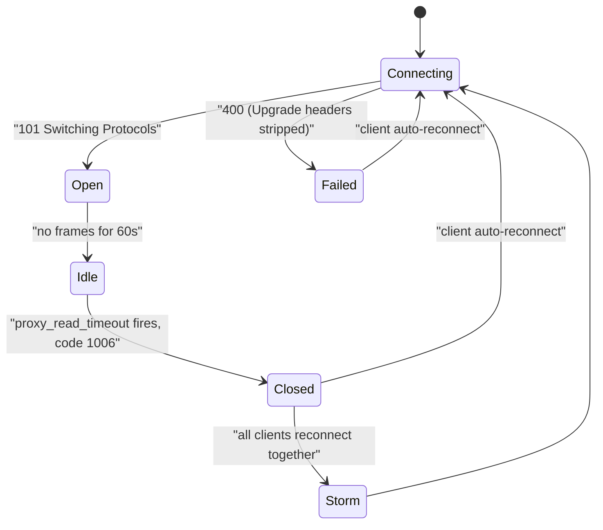
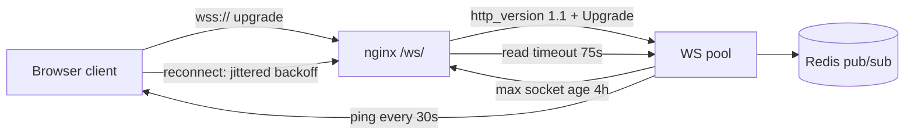

> **Scenario** — A collaborative editor works perfectly on localhost. In production, every client disconnects and reconnects on a 60-second cadence, forever. The backend sees 4,000 WebSocket handshakes per minute for 4,000 users, CPU is pinned by session setup, and the "presence" feature flickers for everyone.

## Why it matters

- A reconnect every 60 seconds means every client re-authenticates, re-subscribes, and re-syncs state — turning a chat feature into a load generator.
- Reconnect storms are self-amplifying: all clients disconnect at the same second because they all connected at the same second after a deploy.
- Proxy misconfiguration here is invisible in application code; the app is correct and still fails in production only.
- Buffering swallows small frames, so "messages arrive late in batches" gets misdiagnosed as a broker or application issue.
- WebSocket connections are balanced once, at connect time — a bad distribution persists for the life of the connection.

## Symptoms

| Signal | What you observe |
| --- | --- |
| Browser console | `WebSocket is closed before the connection is established` or close code 1006 every ~60s |
| nginx `error.log` | `upstream prematurely closed connection while reading upstream` |
| Handshake response | `HTTP/1.1 400 Bad Request` instead of `101 Switching Protocols` |
| Connection lifetime histogram | A sharp spike at exactly 60s or 300s |
| Backend | Handshake rate roughly equals user count divided by the idle timeout |
| Message delivery | Frames arrive in bursts instead of continuously |
| Pod distribution | One pod holds 3× the sockets of its peers after a rolling restart |

## How it breaks

A WebSocket starts life as an HTTP/1.1 request carrying `Connection: Upgrade` and `Upgrade: websocket`. nginx by default speaks HTTP/1.0 to upstreams and strips hop-by-hop headers, so unless you explicitly set `proxy_http_version 1.1` and forward the `Upgrade`/`Connection` headers, the backend never sees an upgrade request and answers with a plain 400 or 200.

Once the upgrade succeeds, the connection is just a long-lived proxied stream — which means `proxy_read_timeout` still applies. Its default is 60s, measured as the gap between reads. A chat that is quiet for 61 seconds is indistinguishable from a hung upstream, so nginx closes it. The client reconnects, and because it originally connected in the same deploy window as everyone else, so does everyone else.



## Root causes

1. Missing `proxy_http_version 1.1`, so the upgrade never reaches the backend.
2. `Upgrade` and `Connection` headers not forwarded (they are hop-by-hop and dropped by default).
3. `proxy_read_timeout` at the 60s default with no application-level ping.
4. `proxy_buffering on` for the WebSocket location, batching small frames.
5. No jitter in the client reconnect strategy, so a synchronized storm follows every deploy or timeout wave.
6. Load balancer or cloud LB idle timeout (often 60s or 350s) below the ping interval.
7. Sockets balanced only at connect time, leaving a lopsided distribution after a rolling restart.

## How to solve it

### 1. Make the upgrade actually reach the backend

```nginx
map $http_upgrade $connection_upgrade {
    default upgrade;
    ''      close;
}

location /ws/ {
    proxy_pass         http://ws_upstream;
    proxy_http_version 1.1;
    proxy_set_header   Upgrade    $http_upgrade;
    proxy_set_header   Connection $connection_upgrade;
    proxy_set_header   Host       $host;
    proxy_set_header   X-Forwarded-For   $proxy_add_x_forwarded_for;
    proxy_set_header   X-Forwarded-Proto $scheme;
}
```

The `map` matters: hardcoding `Connection: upgrade` breaks ordinary HTTP requests that share the location.

### 2. Align timeouts with a ping interval you control

```nginx
location /ws/ {
    # ... upgrade config above ...
    proxy_read_timeout  75s;   # must exceed the app ping interval
    proxy_send_timeout  75s;
    proxy_buffering     off;
}
```

Rule: `app ping interval (30s) < proxy_read_timeout (75s) < LB idle timeout (120s)`. Then the ping keeps every layer's timer alive and no layer surprises another.

### 3. Send heartbeats from the server, not only the client

```ts
const HEARTBEAT_MS = 30_000

wss.on('connection', (socket) => {
  socket.isAlive = true
  socket.on('pong', () => { socket.isAlive = true })
})

setInterval(() => {
  for (const socket of wss.clients) {
    if (!socket.isAlive) { socket.terminate(); continue }
    socket.isAlive = false
    socket.ping()
  }
}, HEARTBEAT_MS)
```

A server-side ping keeps `proxy_read_timeout` fed even when clients are silent, and detects half-open sockets that TCP has not noticed.

### 4. Verify the handshake with curl, not the browser

```bash
curl -i -N -H "Connection: Upgrade" -H "Upgrade: websocket" \
     -H "Sec-WebSocket-Version: 13" \
     -H "Sec-WebSocket-Key: x3JJHMbDL1EzLkh9GBhXDw==" \
     https://app.example.com/ws/
# HTTP/1.1 101 Switching Protocols
# Upgrade: websocket
# Connection: Upgrade
# Sec-WebSocket-Accept: HSmrc0sMlYUkAGmm5OPpG2HaGWk=
```

Anything other than `101` means the proxy layer, not your application, is the problem.

### 5. Make reconnects jittered and capped

```ts
function backoffMs(attempt: number): number {
  const base = Math.min(30_000, 500 * 2 ** attempt)
  return Math.floor(base / 2 + Math.random() * (base / 2))
}
```

Full jitter turns a synchronized wall of reconnects into a smooth ramp. Without it, fixing the timeout simply moves the storm to the next incident.

### 6. Confirm socket distribution after a deploy

```bash
ss -tn state established '( sport = :8080 )' | wc -l
# 1342     <- pod A
# 431      <- pod B
```

If one pod holds three times the sockets, add connection lifetime limits so clients redistribute gradually rather than all at once.

## Target design



## Tradeoffs

| Option | Pros | Cons | Choose when |
| --- | --- | --- | --- |
| Server-side ping | Keeps all proxy timers alive, detects half-open | Small constant traffic per socket | Any production WebSocket |
| Client-side ping only | No server bookkeeping | Silent clients still get culled | Simple, low-value channels |
| Very long `proxy_read_timeout` | Fewer disconnects | Dead upstreams hold sockets for hours | Combined with heartbeats |
| SSE instead of WebSocket | Plain HTTP, easy proxying, auto-reconnect | One-way only | Server-to-client updates only |
| Long polling | Works through anything | High request overhead | Hostile corporate proxies |

## Verification checklist

- [ ] `curl -i -N` handshake returns `101 Switching Protocols`.
- [ ] Connection lifetime histogram has no spike at 60s or 300s.
- [ ] Handshake rate is roughly `users / hours`, not `users / minute`.
- [ ] `nginx -T | grep -A5 'location /ws'` shows `proxy_http_version 1.1` and the `Upgrade` header.
- [ ] A 90-second silent connection stays open in staging.
- [ ] After killing one pod, reconnects spread over 30+ seconds rather than one second.
- [ ] Cloud LB idle timeout is documented and larger than `proxy_read_timeout`.

## Anti-patterns

- Hardcoding `proxy_set_header Connection "upgrade"` on a location that also serves normal HTTP.
- Setting `proxy_read_timeout 86400s` instead of adding heartbeats — dead sockets then accumulate for a day.
- Reconnecting immediately with no backoff, converting a blip into a self-inflicted DDoS.
- Sticky sessions used to paper over missing shared state (Redis pub/sub) between WebSocket pods.
- Assuming a cloud load balancer passes WebSockets by default; many require explicit protocol or idle-timeout config.
- Diagnosing close code 1006 in application code — 1006 means the connection died without a close frame, which is almost always infrastructure.

## Related

- [Reverse proxy buffering and timeout budgets](/systems/networking-edge/reverse-proxy-buffering-and-timeouts)
- [Keepalive and upstream connection reuse](/systems/networking-edge/keepalive-and-connection-reuse)
- [WebSocket state sync at scale](/systems/frontend-architecture/websocket-state-at-scale)
