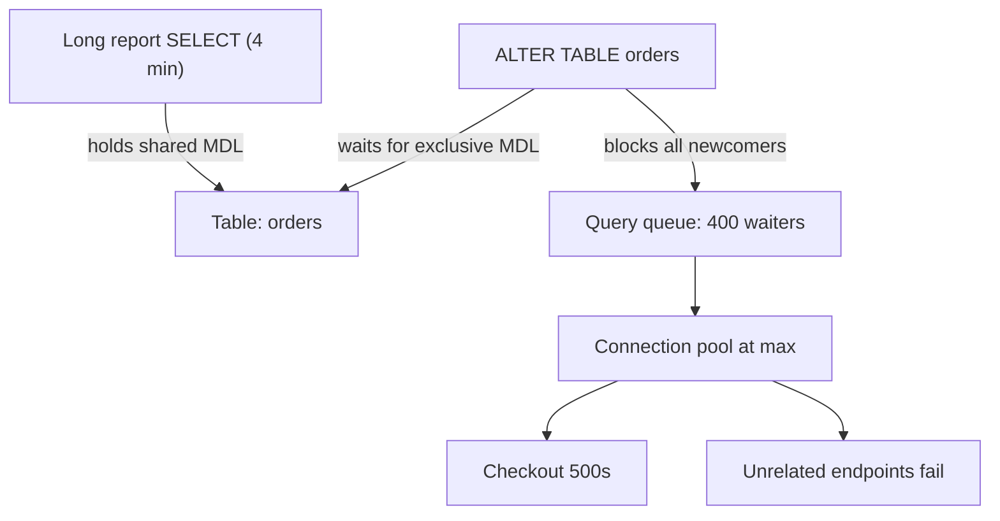
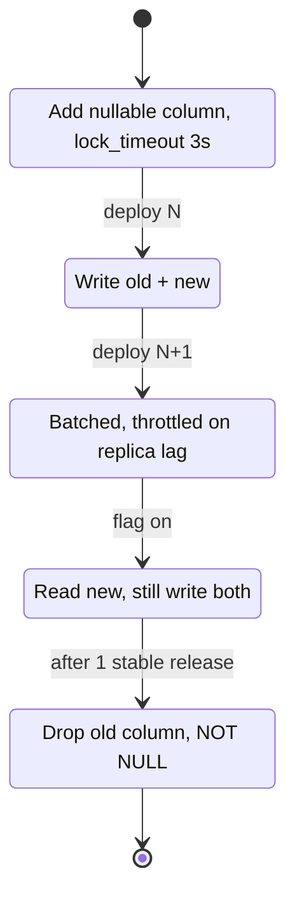

> **Scenario** - শুক্রবারের deploy ৪২ মিলিয়ন row-এর MySQL 8.0 table-এ `ALTER TABLE orders ADD COLUMN fulfilment_state VARCHAR(32) NOT NULL DEFAULT 'pending'` চালায়। DDL নিজে ৯০ সেকেন্ডে শেষ, কিন্তু একটা দীর্ঘ report-এর metadata lock-এর পেছনে `orders`-এর সব query queue হয়ে checkout ১১ মিনিট 500 দেয়।

## কেন গুরুত্বপূর্ণ

- Blocking DDL background maintenance-কে সবচেয়ে busy table-এ পূর্ণ write outage-এ পরিণত করে।
- Lock pileup migration-এর সমান নয়: ৯০ সেকেন্ডের `ALTER` ১১ মিনিট error দিতে পারে, কারণ app ইতিমধ্যে saturated pool-এ retry করে।
- Rollback roll-forward-এর চেয়ে খারাপ। fleet-এর অর্ধেক যে column পড়ছে অন্য অর্ধেক লিখছে না - "just revert" data corrupt করে।
- Migration একমাত্র deploy step যেটা per-request canary করা যায় না - schema হলো global state, প্রতিটি replica ও app version share করে।
- On-call cost asymmetric: রাত ২টায় page হওয়া engineer বুঝতেই পারে না migration ১০% না ৯০% হয়েছে।

## লক্ষণ

| Signal | যা দেখবেন |
| --- | --- |
| MySQL `SHOW PROCESSLIST` | এক table-এ ডজন thread `Waiting for table metadata lock`-এ |
| Postgres `pg_locks` | একটি `AccessExclusiveLock` `granted = false`, পেছনে `RowExclusiveLock` waiter-এর queue |
| App error rate | `SQLSTATE[HY000] Lock wait timeout exceeded` বা `canceling statement due to lock timeout` |
| Connection pool | Active connection `max`-এ আটকে, wait queue বাড়ছে, DB CPU প্রায় idle |
| Deploy pipeline | Migration step timeout ছাড়ায়, CI DDL-এর মাঝপথে process kill করে |
| Replica lag | MySQL-এ lag মিনিটে পৌঁছায়, কারণ DDL প্রতিটি replica-তে serially replay হয় |

## কীভাবে ভাঙে

ব্যর্থতা তিন ধাপের convoy। একটা দীর্ঘ analytics `SELECT` shared metadata lock ধরে আছে। `ALTER` exclusive lock চায় এবং *অপেক্ষা* করে - এতটুকু ক্ষতিকর নয়। ক্ষতি আসে queueing discipline থেকে: MySQL-এ DDL একবার waiting হলে ওই table-এর পরবর্তী প্রতিটি query-ও অপেক্ষা করে, এমনকি সাধারণ `SELECT id FROM orders WHERE id = ?`-ও। তাই একটা slow reader + একটা DDL মিলে পুরো table-এর traffic block করে।

এরপর app এটাকে বড় করে। প্রতিটি blocked request পুরো `lock_wait_timeout` (InnoDB-তে default ৫০ সেকেন্ড) ধরে pool connection ধরে রাখে, pool খালি হয়, এবং যে request `orders` ছোঁয় না সেগুলোও fail করতে শুরু করে।



## মূল কারণ

1. DDL deploy-এর সাথে inline চলে, `lock_timeout` guard ছাড়া, তাই fast fail না করে অনির্দিষ্টকাল অপেক্ষা করে।
2. দীর্ঘ reader (report, `pg_dump`, idle-in-transaction session) যে lock ধরে আছে DDL-কে তার জন্য অপেক্ষা করতে হয়।
3. Single-step migration যা schema বদলায় এবং নতুন app code দরকার করে - পুরনো ও নতুন code দুটোই valid থাকে এমন কোনো version নেই।
4. Backfill পুরো table-এ একটাই `UPDATE` হিসেবে লেখা, ফলে multi-GB undo/WAL burst।
5. Column rename ও type narrowing সরাসরি ship করা, যা মূলগতভাবে backwards-incompatible।
6. "`ADD COLUMN` তো instant" ধরে নেওয়া - Postgres 11+ constant default ও MySQL 8.0 `ALGORITHM=INSTANT`-এ সত্য, কিন্তু type change, পুরনো row-এ `NOT NULL` বা table rebuild লাগলে মিথ্যা।

## কীভাবে সমাধান করবেন

### ১. অপেক্ষা নয়, fast fail

DDL-কে কখনও অপেক্ষা করতে দেবেন না। ছোট lock timeout দিন - migration সাথে সাথে lock পাবে, নাহলে abort হবে, traffic অক্ষত থাকবে।

```sql
-- PostgreSQL: মিনিটের জন্য table block না করে abort করুক
SET lock_timeout = '3s';
SET statement_timeout = '60s';
ALTER TABLE orders ADD COLUMN fulfilment_state text;

-- MySQL 8.0: non-blocking algorithm চাই, সম্ভব না হলে error
SET SESSION lock_wait_timeout = 3;
ALTER TABLE orders
  ADD COLUMN fulfilment_state VARCHAR(32) NULL,
  ALGORITHM=INSTANT;
```

`ALGORITHM=INSTANT` শুধু row format-এর শেষে column জোড়ে; MySQL এটা করতে না পারলে চুপচাপ ৪২ মিলিয়ন row rebuild না করে error দেয়।

### ২. expand–contract ধাপ ব্যবহার করুন

প্রতিটি breaking change এমন deploy-এ ভাগ করুন যেখানে পাশাপাশি দুটি version compatible।

| ধাপ | Schema | Application |
| --- | --- | --- |
| ১ expand | Nullable column / নতুন index যোগ | উপেক্ষা করে |
| ২ dual-write | অপরিবর্তিত | পুরনো ও নতুন দুটোতেই লেখে |
| ৩ backfill | পুরনো row batched update | অপরিবর্তিত |
| ৪ read switch | অপরিবর্তিত | নতুন column পড়ে, দুটোতেই লেখে |
| ৫ contract | পুরনো column drop, `NOT NULL` যোগ | শুধু নতুন column-এ লেখে |

### ৩. bounded batch-এ backfill

একটাই বিশাল `UPDATE` lock ধরে রাখে ও WAL ফুলিয়ে দেয়। primary-key cursor দিয়ে loop করুন, প্রতি batch-এ commit, আর sleep দিয়ে user traffic-এর জন্য IOPS ছেড়ে দিন।

```php
<?php
// Laravel: idempotent, resumable backfill - queued job বা artisan command থেকে
$lastId = 0;
$batch = 5000;

do {
    $ids = DB::table('orders')
        ->where('id', '>', $lastId)
        ->whereNull('fulfilment_state')
        ->orderBy('id')
        ->limit($batch)
        ->pluck('id');

    if ($ids->isEmpty()) {
        break;
    }

    DB::table('orders')
        ->whereIn('id', $ids)
        ->update(['fulfilment_state' => DB::raw("CASE WHEN shipped_at IS NULL THEN 'pending' ELSE 'shipped' END")]);

    $lastId = $ids->last();
    usleep(200_000); // ২০০ ms: write rate সীমিত রাখুন, replica lag দেখুন
} while (true);
```

### ৪. exclusive lock ছাড়া index তৈরি

```sql
-- PostgreSQL: write lock নেই, কিন্তু transaction block-এ চলে না
CREATE INDEX CONCURRENTLY idx_orders_fulfilment
  ON orders (fulfilment_state, created_at DESC);

-- fail করলে invalid index রেখে যায়; retry-র আগে পরিষ্কার করুন
DROP INDEX CONCURRENTLY IF EXISTS idx_orders_fulfilment;
```

MySQL 8.0 secondary index online তৈরি করে (`ALGORITHM=INPLACE, LOCK=NONE`), তবু শুরু ও শেষে সংক্ষিপ্ত exclusive metadata lock লাগে - তাই ধাপ ১ জরুরি।

### ৫. constraint দুই ধাপে যোগ করুন

```sql
-- সস্তা: শুধু নতুন row-এ validate, full scan নেই
ALTER TABLE orders
  ADD CONSTRAINT orders_fulfilment_not_null
  CHECK (fulfilment_state IS NOT NULL) NOT VALID;

-- পরে, off-peak: দুর্বল SHARE UPDATE EXCLUSIVE lock নিয়ে scan
ALTER TABLE orders VALIDATE CONSTRAINT orders_fulfilment_not_null;
```

### ৬. table rebuild-এ shadow-copy tool

```bash
gh-ost \
  --host=db-primary.internal --database=shop --table=orders \
  --alter="MODIFY total_cents BIGINT NOT NULL" \
  --max-load="Threads_running=40" \
  --critical-load="Threads_running=120" \
  --max-lag-millis=1500 \
  --chunk-size=1000 \
  --cut-over=atomic --allow-on-master --execute
```

`gh-ost` ghost table-এ row copy করে, binlog থেকে পরিবর্তন tail করে, replica lag-এ throttle করে, আর এক সেকেন্ডের কম সময়ে table swap করে।

## Target design



## Tradeoff

| Option | সুবিধা | খরচ | কখন বাছবেন |
| --- | --- | --- | --- |
| Deploy-এ inline DDL | সহজ, এক PR | Table block, unbounded lock wait | ~১০ লাখ row-এর কম ছোট table, off-peak |
| Expand–contract | Downtime নেই, প্রতি ধাপে revertible | ৩–৫ deploy, সাময়িক dual-write code | যেকোনো hot table বা breaking change |
| `gh-ost` / `pt-online-schema-change` | Full rebuild সামলায়, নিজে throttle করে | বাড়তি disk, trigger/binlog নির্ভরতা, foreign-key caveat | বড় table-এ MySQL type change |
| Postgres `CREATE INDEX CONCURRENTLY` | Write lock নেই | ধীর, invalid index রেখে যেতে পারে | Live table-এ index যোগ |
| Maintenance window | Predictable, সহজ reasoning | আসল downtime, globally schedule করা কঠিন | Regulated batch system যাদের সত্যিই quiet period আছে |

## যাচাই checklist

- [ ] Migration script-এ `lock_timeout` (Postgres) বা `lock_wait_timeout` (MySQL) মিনিট নয়, সেকেন্ডে সেট করা।
- [ ] `EXPLAIN`/`ALGORITHM` dry run নিশ্চিত করে DDL instant বা inplace, copy নয়।
- [ ] Staging run production-scale row count-এ, খালি schema-তে নয়।
- [ ] Backfill job resumable: মাঝপথে kill করে restart করলে একই ফল।
- [ ] Backfill চলাকালীন replica lag graph SLO threshold-এর নিচে থাকে।
- [ ] পুরনো app version *নতুন* schema-র বিরুদ্ধে test suite পাস করে (backwards compatibility)।
- [ ] DDL চালানোর আগে `pg_stat_activity` / `SHOW PROCESSLIST`-এ `idle in transaction` session দেখা হয়েছে।
- [ ] Contract ধাপ এমন dashboard-এ gate করা যা পুরনো column-এ শূন্য read দেখায়।

## Anti-pattern

- Blocked `ALTER` loop-এ retry করা - প্রতিটি চেষ্টা পুরো table আবার queue করে।
- `CREATE INDEX CONCURRENTLY` transaction-এ মোড়া (Postgres reject করে) বা এমন framework migration-এ রাখা যা implicit transaction খোলে।
- একই release-এ column rename ও app change ship করা।
- ৪ কোটি row-এর table-এ `WHERE` ছাড়া `UPDATE table SET col = ...`, তারপর disk ভরে যাওয়ায় বিস্ময়।
- চলমান `gh-ost` cut-over kill করে `_orders_gho` ফেলে রাখা।
- MySQL 5.7-এ `ADD COLUMN ... NOT NULL DEFAULT` free ধরে নেওয়া - এটা table rebuild করে।
- "migration succeeded" মানে "migration safe" ভাবা: lock-এর ক্ষতি success-এর আগেই হয়ে যায়।

## সম্পর্কিত

- [Index design ও query plan পড়া](/systems/data-storage/index-design-and-query-plans)
- [বিশাল table archive ও prune](/systems/data-storage/large-table-archival-strategy)
- [Concurrent load-এ database deadlock](/systems/data-storage/database-deadlocks-under-load)
- [Replication lag ও read-your-writes](/systems/data-storage/replication-lag-read-your-writes)
