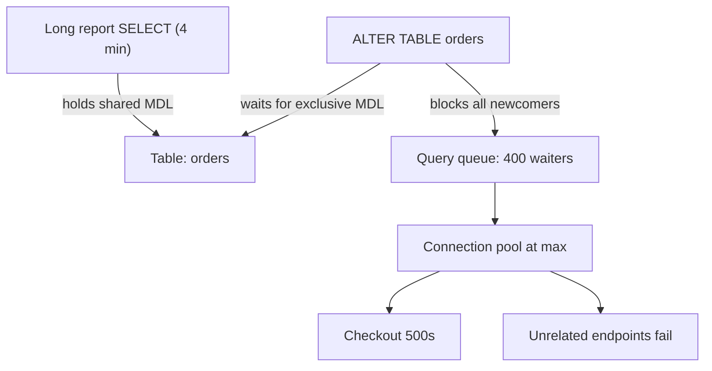
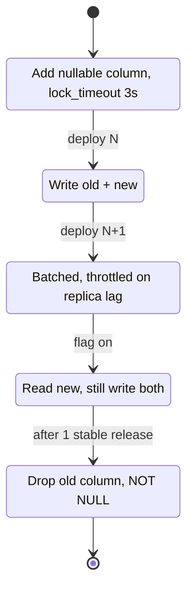

> **Scenario** - A Friday deploy runs `ALTER TABLE orders ADD COLUMN fulfilment_state VARCHAR(32) NOT NULL DEFAULT 'pending'` against a 42 M-row MySQL 8.0 table. The DDL itself finishes in 90 seconds, but checkout returns 500s for eleven minutes because every query on `orders` queued behind a metadata lock held by one long-running report.

## Why it matters

- A blocking DDL converts a *background* maintenance task into a full write outage on your busiest table.
- The lock pileup is not proportional to the migration: a 90-second `ALTER` can produce 11 minutes of errors because the app retries into an already-saturated connection pool.
- Rollback is worse than roll-forward. Once half your fleet reads a column the other half does not write, "just revert" corrupts data.
- Migrations are the one deploy step you cannot canary per-request - the schema is global state shared by every replica and every app version.
- On-call cost is asymmetric: the engineer paged at 02:00 usually cannot tell whether the migration is 10% or 90% done.

## Symptoms

| Signal | What you observe |
| --- | --- |
| MySQL `SHOW PROCESSLIST` | Dozens of threads in `Waiting for table metadata lock`, all on one table |
| Postgres `pg_locks` | One `AccessExclusiveLock` in `granted = false`, with a queue of `RowExclusiveLock` waiters behind it |
| App error rate | `SQLSTATE[HY000] Lock wait timeout exceeded` or `canceling statement due to lock timeout` |
| Connection pool | Active connections pinned at `max`, wait queue growing, DB CPU near idle |
| Deploy pipeline | Migration step exceeds its timeout, CI kills the process mid-DDL |
| Replica lag | Lag climbs to minutes on MySQL because the DDL replays serially on each replica |

## How it breaks

The failure is a three-stage convoy. A long analytics `SELECT` holds a shared metadata lock. The `ALTER` requests an exclusive lock and *waits* - harmless so far. The damage comes from the queueing discipline: in MySQL, once a DDL is waiting, every subsequent query on that table also waits, even simple `SELECT id FROM orders WHERE id = ?`. A single slow reader plus a DDL therefore blocks all traffic on the table.

The app then amplifies it. Each blocked request holds a pool connection for the full `lock_wait_timeout` (default 50 s in InnoDB), the pool drains, and requests that never touch `orders` start failing too.



## Root causes

1. DDL executed inline with the deploy, with no `lock_timeout` guard, so it waits indefinitely instead of failing fast.
2. Long-running readers (reports, `pg_dump`, idle-in-transaction sessions) holding locks the DDL must wait for.
3. Single-step migrations that both change the schema and require new application code - no version where old and new code are both valid.
4. Backfills written as one `UPDATE` over the whole table, generating a multi-GB undo/WAL burst.
5. Column renames and type narrowing shipped directly, which are inherently non-backwards-compatible.
6. Assuming "`ADD COLUMN` is instant" - true for Postgres 11+ with a constant default and MySQL 8.0 `ALGORITHM=INSTANT`, false for type changes, `NOT NULL` on existing rows, or anything requiring a table rebuild.

## How to solve it

### 1. Fail fast instead of queueing

Never let a DDL wait. Set a short lock timeout so the migration either grabs the lock immediately or aborts and is retried, leaving traffic untouched.

```sql
-- PostgreSQL: abort rather than block the table for minutes
SET lock_timeout = '3s';
SET statement_timeout = '60s';
ALTER TABLE orders ADD COLUMN fulfilment_state text;

-- MySQL 8.0: prefer a non-blocking algorithm and bail out if impossible
SET SESSION lock_wait_timeout = 3;
ALTER TABLE orders
  ADD COLUMN fulfilment_state VARCHAR(32) NULL,
  ALGORITHM=INSTANT;
```

`ALGORITHM=INSTANT` only appends to the end of the row format; if MySQL cannot honour it, the statement errors instead of silently rebuilding 42 M rows.

### 2. Use the expand–contract sequence

Split every breaking change into deploys where consecutive versions are compatible.

| Step | Schema | Application |
| --- | --- | --- |
| 1 expand | Add nullable column / new index | Ignores it |
| 2 dual-write | unchanged | Writes both old and new column |
| 3 backfill | Batched update of historical rows | unchanged |
| 4 read switch | unchanged | Reads new column, still writes both |
| 5 contract | Drop old column, add `NOT NULL` | Writes only new column |

### 3. Backfill in bounded batches

One giant `UPDATE` holds locks and inflates WAL. Loop with a primary-key cursor, commit per batch, and sleep to leave IOPS for user traffic.

```php
<?php
// Laravel: idempotent, resumable backfill run from a queued job or artisan command
$lastId = 0;
$batch = 5000;

do {
    $ids = DB::table('orders')
        ->where('id', '>', $lastId)
        ->whereNull('fulfilment_state')
        ->orderBy('id')
        ->limit($batch)
        ->pluck('id');

    if ($ids->isEmpty()) {
        break;
    }

    DB::table('orders')
        ->whereIn('id', $ids)
        ->update(['fulfilment_state' => DB::raw("CASE WHEN shipped_at IS NULL THEN 'pending' ELSE 'shipped' END")]);

    $lastId = $ids->last();
    usleep(200_000); // 200 ms: cap the write rate, watch replica lag
} while (true);
```

### 4. Build indexes without exclusive locks

```sql
-- PostgreSQL: no write lock, but cannot run inside a transaction block
CREATE INDEX CONCURRENTLY idx_orders_fulfilment
  ON orders (fulfilment_state, created_at DESC);

-- If it fails it leaves an invalid index; clean it up before retrying
DROP INDEX CONCURRENTLY IF EXISTS idx_orders_fulfilment;
```

MySQL 8.0 builds secondary indexes online (`ALGORITHM=INPLACE, LOCK=NONE`) but still needs a brief exclusive metadata lock at start and end - which is exactly why step 1 matters.

### 5. Add constraints in two phases

```sql
-- Cheap: validated only for new rows, no full scan
ALTER TABLE orders
  ADD CONSTRAINT orders_fulfilment_not_null
  CHECK (fulfilment_state IS NOT NULL) NOT VALID;

-- Later, off-peak: scans with a weak SHARE UPDATE EXCLUSIVE lock
ALTER TABLE orders VALIDATE CONSTRAINT orders_fulfilment_not_null;
```

### 6. For table rebuilds, use a shadow-copy tool

```bash
gh-ost \
  --host=db-primary.internal --database=shop --table=orders \
  --alter="MODIFY total_cents BIGINT NOT NULL" \
  --max-load="Threads_running=40" \
  --critical-load="Threads_running=120" \
  --max-lag-millis=1500 \
  --chunk-size=1000 \
  --cut-over=atomic --allow-on-master --execute
```

`gh-ost` copies rows into a ghost table, tails the binlog for changes, throttles on replica lag, and swaps tables in a sub-second cut-over.

## Target design



## Tradeoffs

| Option | Pros | Cons | Choose when |
| --- | --- | --- | --- |
| Inline DDL in deploy | Simple, one PR | Blocks table, unbounded lock wait | Small tables under ~1 M rows, off-peak |
| Expand–contract | No downtime, revertible at each step | 3–5 deploys, temporary dual-write code | Any hot table or breaking change |
| `gh-ost` / `pt-online-schema-change` | Handles full rebuilds, throttles itself | Extra disk, triggers or binlog dependency, foreign-key caveats | MySQL type changes on large tables |
| Postgres `CREATE INDEX CONCURRENTLY` | No write lock | Slower, can leave invalid index | Adding indexes to live tables |
| Maintenance window | Predictable, simplest reasoning | Real downtime, hard to schedule globally | Regulated batch systems with a real quiet period |

## Verification checklist

- [ ] Migration script sets `lock_timeout` (Postgres) or `lock_wait_timeout` (MySQL) to seconds, not minutes.
- [ ] `EXPLAIN`/`ALGORITHM` dry run confirms the DDL is instant or inplace, not a copy.
- [ ] Staging run against a table with production-scale row count, not an empty schema.
- [ ] Backfill job is resumable: killing it mid-run and restarting produces the same result.
- [ ] Replica lag graph stays under your SLO threshold during the backfill.
- [ ] Previous application version passes its test suite against the *new* schema (backwards compatibility).
- [ ] `pg_stat_activity` / `SHOW PROCESSLIST` checked for `idle in transaction` sessions before the DDL runs.
- [ ] Contract step gated on a dashboard showing zero reads of the old column.

## Anti-patterns

- Retrying a blocked `ALTER` in a loop - each attempt re-queues the whole table.
- Wrapping `CREATE INDEX CONCURRENTLY` in a transaction (Postgres rejects it) or in a framework migration that opens one implicitly.
- Renaming a column and shipping the app change in the same release.
- `UPDATE table SET col = ...` with no `WHERE` on a 40 M-row table, then wondering why disk filled up.
- Killing a running `gh-ost` cut-over and leaving `_orders_gho` behind.
- Trusting `ADD COLUMN ... NOT NULL DEFAULT` to be free on MySQL 5.7 - it rebuilds the table.
- Treating "migration succeeded" as "migration is safe": the lock damage happens before success.

## Related

- [Index design and reading query plans](/systems/data-storage/index-design-and-query-plans)
- [Archiving and pruning very large tables](/systems/data-storage/large-table-archival-strategy)
- [Database deadlocks under concurrent load](/systems/data-storage/database-deadlocks-under-load)
- [Replication lag and read-your-writes](/systems/data-storage/replication-lag-read-your-writes)
